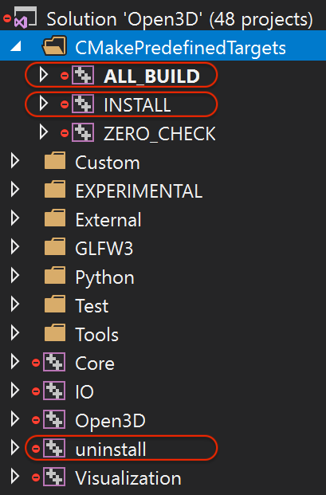

.. _getting_started:

Getting Started
#######################

This guide gets you started programming with Open3D. The basic tools you need are `git <https://git-scm.com/>`_, `CMake <https://cmake.org/>`_, and **a non-ancient C++ compiler** that supports C++11, such as gcc 4.8+, Visual Studio 2015 update 3+, or XCode 8.0+. If you want to install the Python binding, make sure you have Python 2.7 or 3.5+ installed.

.. _getting_started_compilation:

Compiling from source
========================

Download source code from the `repository <https://github.com/IntelVCL/Open3D>`_.

.. code-block:: bash

    git clone https://github.com/IntelVCL/Open3D

.. _getting_started_compilation_ubuntu:

Ubuntu
-----------

Run the following commands to install the dependencies and use CMake to build the project.

.. code-block:: bash

    util/scripts/install-deps-ubuntu.sh
    mkdir build
    cd build
    cmake -DCMAKE_INSTALL_PREFIX=<open3d_install_directory> ..
    make -j

The ``CMAKE_INSTALL_PREFIX`` argument is optional and can be used to install Open3D to a user location.
In the absence of this argument Open3D will be installed to a system location (sudo required).

.. tip:: In order to build the Open3D Python module with a particular Python version in mind see :ref:`python_binding`.

Install/uninstall the Open3D libraries, headers and Python module by running:

.. code-block:: sh

    cd build
    make install
    ...
    make uninstall

.. tip:: You will need ``sudo`` to install Open3D to a system location.

.. _getting_started_compilation_osx:

OS X
-----------

To compile from the terminal, follow the last section for :ref:`getting_started_compilation_ubuntu` but replace ``install-deps-ubuntu.sh`` with ``install-deps-osx.sh``. We use `homebrew <https://brew.sh/>`_ to manage dependencies. Follow the instructions from the script.

Alternatively, if you want to use Xcode IDE, run:

.. code-block:: bash

    util/scripts/install-deps-osx.sh
    mkdir build-xcode
    cd build-xcode
    cmake -G Xcode -DCMAKE_INSTALL_PREFIX=<open3d_install_directory> ..
    open Open3D.xcodeproj/

The ``CMAKE_INSTALL_PREFIX`` argument is optional.

Install/uninstall the Open3D libraries, headers and Python module by running:

.. code-block:: sh

    cd build
    make install
    ...
    make uninstall

.. tip:: You will need ``sudo`` to install Open3D to a system location.

.. _getting_started_compilation_windows:

Windows
-----------

On Windows, only **Visual Studio 2015 update 3** and newer are supported since Open3D relies heavily on C++11 language features. For easy compilation, we have included source code of all dependent libraries in the ``3rdparty`` folder.

You can use the CMake GUI as shown in the following figure. Specify the directories, click ``Configure`` and choose the correct Visual Studio version (e.g., ``Visual Studio 14 2015 Win64``), then click ``Generate``. This will create an ``Open3D.sln`` file in your build directory.

.. image:: _static/cmake_windows.png
    :width: 500px

Alternatively, this file can be generated by calling CMake from the console:

.. code-block:: bash

    mkdir build
    cd build
    cmake -G "Visual Studio 14 2015 Win64" ..

.. error:: cmake may fail to find ``PYTHON_EXECUTABLE``. In this case, please specify the path manually.

Open ``Open3D.sln`` file with Visual Studio, change the build type to ``Release``, then rebuild the ``ALL_BUILD`` target.

Install/uninstall the Open3D libraries, headers and Python module by building the ``INSTALL``/``uninstall`` targets.

Running Open3D tutorials
========================================

Importing open3d module
-----------------------

For quick sanity check, try importing the library from the python interactive shell:

.. code-block:: sh

    python

    >>> import open3d

.. error:: If there is an issue, check whether the Python version detected by cmake (see log from cmake) and the Python version for command line environment (type python -V). They should match. If it is not, please follow :ref:`python_binding` in docs. In addition, `python binding issue  <https://github.com/IntelVCL/Open3D/issues?utf8=%E2%9C%93&q=is%3Aissue+label%3A%22python+binding%22+>`_ on Github repository has helpful notes from Open3D users.

Python tutorials
------------------

A complete set of Python tutorials and testing data will also be copied to demonstrate the usage of Open3D Python interface.
For example, tutorial ``Basic/rgbd_redwood.py`` can be run with:

.. code-block:: bash

    cd lib/Tutorial/Basic
    python rgbd_redwood.py

It reads a pair of RGB-D images and visualizes them.

.. image:: _static/Basic/rgbd_images/redwood_rgbd.png
    :width: 400px

It then transforms the RGB-D image into a point cloud, then renders the point cloud using Open3D visualizer.

.. image:: _static/Basic/rgbd_images/redwood_pcd.png
    :width: 400px

The Python code is quite straightforward, and the detailed explanation can be found in :ref:`rgbd_redwood`.
You may further experiment with different tutorials or check out the complete tutorial list in the :ref:`tutorial_index` page.

.. note:: Open3D's Python tutorial utilizes some external packages: ``numpy``, ``matplotlib``, ``opencv-python``. OpenCV is only used for reconstruction system. Please read util/scripts/install-deps-python.sh for installing these packages.
