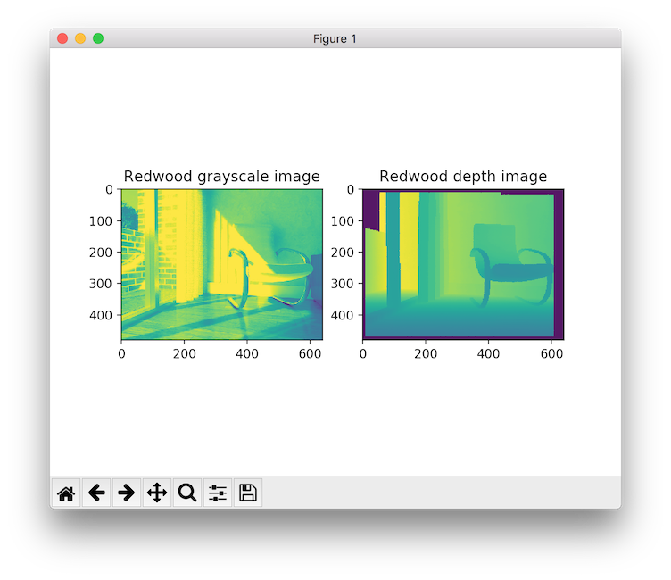
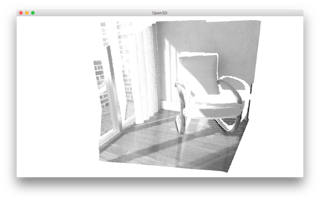

.. _getting_started:

Getting Started
###############

.. _install_open3d_python:

Installing from PyPI or Conda
=============================

Open3D Python packages are distributed via
`PyPI <https://pypi.org/project/open3d/>`_ and
`Conda <https://anaconda.org/open3d-admin/open3d>`_.

Supported Python versions:

* 2.7
* 3.5
* 3.6

Supported operating systems:

* Ubuntu (tested on 16.04, should work on other modern versions)
* MacOS
* Windows 10 (32-bit and 64-bit)

PyPI
----

.. code-block:: bash

    pip install open3d

Note: In general, we recommend using a
`virtual environment <https://docs.python-guide.org/dev/virtualenvs/>`_ for
containerization. Otherwise, depending on the configurations, ``pip3`` may be
needed for Python 3, or the ``--user`` option may need to be used to avoid
permission issues. For example:

.. code-block:: bash

    pip3 install open3d
    # or
    pip install --user open3d
    # or
    python3 -m pip install --user open3d

Conda
-----

.. code-block:: bash

    conda install -c open3d-admin open3d

Note: Open3D prebuilt binaries for Conda (Anaconda/Miniconda) can be found at
`open3d <https://anaconda.org/open3d-admin/open3d>`_. Currently, the ``open3d``
package is distributed under the ``open3d-admin`` channel. To setup Conda,
please see `the official documentations <https://conda.io/docs/user-guide/install/index.html>`_.

Try it
------

Now, try importing Open3D.

.. code-block:: bash

    python -c "import open3d"

If this works, congratulations, now Open3D has been successfully installed!

Running Open3D tutorials
========================

A complete set of Python tutorials and testing data will also be copied to
demonstrate the usage of Open3D Python interface.
For example, tutorial ``Basic/rgbd_redwood.py`` can be run with:

.. code-block:: bash

    cd lib/Tutorial/Basic
    python rgbd_redwood.py

It reads a pair of RGB-D images and visualizes them.

It then transforms the RGB-D image into a point cloud, then renders the point
cloud using Open3D visualizer.

The Python code is quite straightforward, and the detailed explanation can be
found in :ref:`rgbd_redwood`.
You may further experiment with different tutorials or check out the complete
tutorial list in the :ref:`tutorial_index` page.

.. note:: Open3D's Python tutorial utilizes some external packages: ``numpy``,
    ``matplotlib``, ``opencv-python``. OpenCV is only used for reconstruction
    system. Please read util/scripts/install-deps-python.sh for installing these
    packages.
