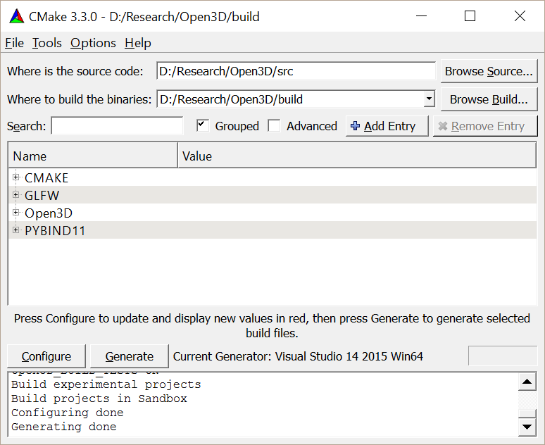

.. _getting_started:

Getting Started
#######################

This guide gets you started programming with Open3D. The basic tools you need are `git <https://git-scm.com/>`_, `CMake <https://cmake.org/>`_, and **a non-ancient C++ compiler** that supports C++11, such as gcc 4.8+, Visual Studio 2015+, or XCode 8.0+. If you want to install the Python binding, make sure you have Python 2.7 or 3.5+ installed.

.. _getting_started_compilation:

Compiling from source
========================

Download source code from the `repository <https://github.com/IntelVCL/Open3D>`_.

.. code-block:: bash

    git clone https://github.com/IntelVCL/Open3D

Ubuntu
-----------

Run the following commands to install the dependencies and use CMake to build the project.

.. code-block:: bash

    scripts/install-deps-ubuntu.sh
    mkdir build
    cd build
    cmake ../src
    make -j

OS X
-----------

To compile from the terminal, follow the last section but replace ``install-deps-ubuntu.sh`` with ``install-deps-osx.sh``. We use `homebrew <https://brew.sh/>`_ to manage dependencies. Follow the instructions from the script.

Alternatively, if you want to use Xcode IDE, run:

.. code-block:: bash

    scripts/install-deps-osx.sh
    mkdir build-xcode
    cd build-xcode
    cmake -G Xcode ../src
    open Open3D.xcodeproj/

Windows
-----------

On Windows, only **Visual Studio 2015** and newer are supported since Open3D relies heavily on C++11 language features. For easy compilation, we have included source code of all dependent libraries in the ``src/External`` folder.

You can use the CMake GUI as shown in the following figure. Specify the directories, click ``Configure`` and choose the correct Visual Studio version (e.g., ``Visual Studio 14 2015 Win64``), then click ``Generate``. This will create an ``Open3D.sln`` file in your build directory.

Alternatively, this file can be generated by calling CMake from the console:

.. code-block:: bash

    mkdir build
    cd build
    cmake -G "Visual Studio 14 2015 Win64" ../src

Open ``Open3D.sln`` file with Visual Studio, change the build type to ``Release``, then rebuild the ``ALL_BUILD`` target.

Running Open3D tutorials
========================================

By default, compiling Open3D will create a Python library under directory ``build/lib/`` or ``build/lib/release/``. A complete set of Python tutorials and testing data will also be copied to the same directory to demonstrate the usage of Open3D Python interface.

For example, tutorial ``Basic/rgbd_redwood.py`` can be run with:

.. code-block:: bash

    cd lib/Tutorial/Basic
    python rgbd_redwood.py

It reads a pair of RGB-D images and visualizes them.

.. image:: _static/Basic/rgbd_images/redwood_rgbd.png
    :width: 400px

It then transforms the RGB-D image into a point cloud, then renders the point cloud using Open3D visualizer.

.. image:: _static/Basic/rgbd_images/redwood_pcd.png
    :width: 400px

.. note:: If there is an error regarding importing ``py3d``, check whether the Python version detected by cmake (see cmake log) and the Python version for command line environment (type ``python -V``) match. If it is not, please follow :ref:`python_binding` in compilation options.

The Python code is quite straightforward, and the detailed explanation can be found in :ref:`rgbd_redwood`.

.. code-block:: python

    # src/Python/Tutorial/Basic/rgbd_redwood.py

    import sys
    sys.path.append("../..")

    #conda install pillow matplotlib
    from py3d import *
    import matplotlib.pyplot as plt

    if __name__ == "__main__":
        print("Read Redwood dataset")
        color_raw = read_image("../../TestData/RGBD/color/00000.jpg")
        depth_raw = read_image("../../TestData/RGBD/depth/00000.png")
        rgbd_image = create_rgbd_image_from_color_and_depth(
            color_raw, depth_raw);
        print(rgbd_image)
        plt.subplot(1, 2, 1)
        plt.title('Redwood grayscale image')
        plt.imshow(rgbd_image.color)
        plt.subplot(1, 2, 2)
        plt.title('Redwood depth image')
        plt.imshow(rgbd_image.depth)
        plt.show()
        pcd = create_point_cloud_from_rgbd_image(rgbd_image,
                PinholeCameraIntrinsic.prime_sense_default)
        # Flip it, otherwise the pointcloud will be upside down
        pcd.transform([[1, 0, 0, 0], [0, -1, 0, 0], [0, 0, -1, 0], [0, 0, 0, 1]])
        draw_geometries([pcd])

You may further experiment with different tutorials or check out the complete tutorial list in the :ref:`tutorial_index` page.
