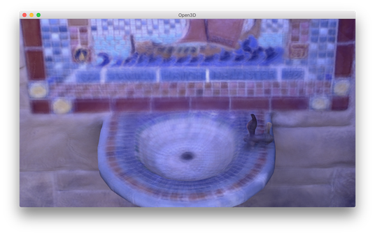

.. _color_map_optimization:

Color Map Optimization
-------------------------------------

Consider color mapping to the geometry reconstructed from depth cameras. As color and depth frames are not perfectly aligned, the texture mapping using color images is subject to results in blurred color map. Open3D provides color map optimization method proposed by [Zhou2014]_. Before begin, download fountain dataset from `here <https://drive.google.com/open?id=1eT45y8qw3TLED2YY9-K1Ot6dQuF9GDPJ>`_.

.. code-block:: python

    # src/Python/Tutorial/Advanced/color_map_optimization.py

    from py3d import *
    from trajectory_io import *
    import os, sys
    sys.path.append("../Utility")
    from common import *

    path = "[set_this_path_to_fountain_dataset]"
    debug_mode = False

    if __name__ == "__main__":
        set_verbosity_level(VerbosityLevel.Debug)

        # Read RGBD images
        rgbd_images = []
        depth_image_path = get_file_list(
                os.path.join(path, "depth/"), extension = ".png")
        color_image_path = get_file_list(
                os.path.join(path, "image/"), extension = ".jpg")
        assert(len(depth_image_path) == len(color_image_path))
        for i in range(len(depth_image_path)):
            depth = read_image(os.path.join(depth_image_path[i]))
            color = read_image(os.path.join(color_image_path[i]))
            rgbd_image = create_rgbd_image_from_color_and_depth(color, depth,
                    convert_rgb_to_intensity = False)
            if debug_mode:
                pcd = create_point_cloud_from_rgbd_image(rgbd_image,
                        PinholeCameraIntrinsic.get_prime_sense_default())
                draw_geometries([pcd])
            rgbd_images.append(rgbd_image)

        # Read camera pose and mesh
        camera = read_pinhole_camera_trajectory(os.path.join(path, "scene/key.log"))
        mesh = read_triangle_mesh(os.path.join(path, "scene", "integrated.ply"))

        # Before full optimization, let's just visualize texture map
        # with given geometry, RGBD images, and camera poses.
        option = TextureMapOptmizationOption()
        option.maximum_iteration = 0
        texture_map_optimization(mesh, rgbd_images, camera, option)
        draw_geometries([mesh])

        # Optimize texture and save the mesh as texture_mapped.ply
        # This is implementation of following paper
        # Q.-Y. Zhou and V. Koltun,
        # Color Map Optimization for 3D Reconstruction with Consumer Depth Cameras,
        # SIGGRAPH 2014
        option.maximum_iteration = 500
        option.non_rigid_camera_coordinate = True
        texture_map_optimization(mesh, rgbd_images, camera, option)
        draw_geometries([mesh])
        write_triangle_mesh(os.path.join(path, "scene", "texture_mapped.ply"), mesh)

Input
````````````````````````

.. code-block:: python

    # read RGBD images
    rgbd_images = []
    depth_image_path = get_file_list(
            os.path.join(path, "depth/"), extension=".png")
    color_image_path = get_file_list(
            os.path.join(path, "image/"), extension=".jpg")
    assert(len(depth_image_path) == len(color_image_path))
    for i in range(len(depth_image_path)):
        depth = read_image(os.path.join(depth_image_path[i]))
        color = read_image(os.path.join(color_image_path[i]))
        rgbd_image = create_rgbd_image_from_color_and_depth(color, depth,
                convert_rgb_to_intensity=False)
        if debug_mode:
            pcd = create_point_cloud_from_rgbd_image(rgbd_image,
                    PinholeCameraIntrinsic.get_prime_sense_default())
            draw_geometries([pcd])
        rgbd_images.append(rgbd_image)

This script reads color and depth image pairs and makes ``rgbd_image``. Note that ``convert_rgb_to_intensity`` flag is ``False``. This is to preserve 8-bit color channels instead of using single channel float type image.

It is always good practice to visualize RGBD image before applying it to color map optimization. ``debug_mode`` switch is for visualizing RGBD image.

.. code-block:: python

    # read camera pose and mesh
    camera = read_pinhole_camera_trajectory(os.path.join(path, "scene/key.log"))
    mesh = read_triangle_mesh(os.path.join(path, "scene", "integrated.ply"))

The script reads camera trajectory and mesh.

.. code-block:: python

    option = TextureMapOptmizationOption()
    option.maximum_iteration = 0
    texture_map_optimization(mesh, rgbd_images, camera, option)
    draw_geometries([mesh])

To visualize how the camera poses are not good for color mapping, this script intentionally set the iteration number as 0, which means no optimization. ``texture_map_optimization`` paints a mesh using corresponding RGBD images and camera poses. Without optimization, the texture map is blurred.




Rigid Optimization
```````````````````````````````

The next step is to optimize camera poses to get a sharp color map.

.. code-block:: python

    option.maximum_iteration = 500
    texture_map_optimization(mesh, rgbd_images, camera, option)
    draw_geometries([mesh])
    write_triangle_mesh(os.path.join(path, "scene", "texture_mapped.ply"), mesh)

The script sets ``maximum_iteration = 500`` for actual iterations. The optimization displays the following energy profile.

.. code-block:: shell

    [TextureMapOptimization] :: Rigid Optimization
    [Iteration #0000] Residual error : 35745.077565 (avg : 0.006930)
    [Iteration #0001] Residual error : 35633.791960 (avg : 0.006909)
    [Iteration #0002] Residual error : 35518.568729 (avg : 0.006886)
    :
    [Iteration #0497] Residual error : 17452.550395 (avg : 0.003407)
    [Iteration #0498] Residual error : 17452.747174 (avg : 0.003407)
    [Iteration #0499] Residual error : 17451.573304 (avg : 0.003407)

Residual error implies inconsistency of image intensities. Lower residual leads better color map quality. By default, ``TextureMapOptmizationOption`` enables rigid optimization. It optimizes 6-dimentional pose of every cameras.

.. image:: ../../_static/Advanced/texture_map_optimization/rigid.png
    :width: 300px

.. image:: ../../_static/Advanced/texture_map_optimization/rigid_zoom.png
    :width: 300px

Non-rigid Optimization
```````````````````````````````````

For better alignment quality, there is an option for non-rigid optimization. To enable, simply add

.. code-block:: python

    option.non_rigid_camera_coordinate = True

before calling ``texture_map_optimization``. Besides 6-dimentional camera poses, non-rigid optimization even consider local image warping represented by anchor points. This adds even more flexibility and leads higher quality color map. Due to increased number of parameters, non-rigid optimization is slower than rigid optimization option.

Results of non-rigid optimization follow.

.. image:: ../../_static/Advanced/texture_map_optimization/non_rigid.png
    :width: 300px

.. image:: ../../_static/Advanced/texture_map_optimization/non_rigid_zoom.png
    :width: 300px
