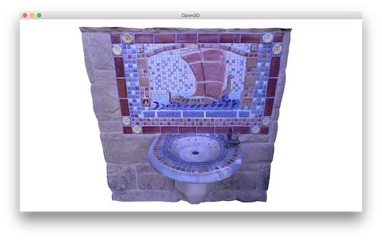

.. _color_map_optimization:

Color Map Optimization
-------------------------------------

Consider color mapping to the geometry reconstructed from depth cameras. As color and depth frames are not perfectly aligned, the texture mapping using color images is subject to results in blurred color map. Open3D provides color map optimization method proposed by [Zhou2014]_. Before begin, download fountain dataset from `here <https://drive.google.com/open?id=1eT45y8qw3TLED2YY9-K1Ot6dQuF9GDPJ>`_. The following script shows an example of color map optimization.

.. literalinclude:: ../../../examples/Python/Advanced/color_map_optimization.py
   :language: python
   :lineno-start: 5
   :lines: 5-
   :linenos:


Input
````````````````````````

.. literalinclude:: ../../../examples/Python/Advanced/color_map_optimization.py
   :language: python
   :lineno-start: 19
   :lines: 19-38
   :linenos:

This script reads color and depth image pairs and makes ``rgbd_image``. Note that ``convert_rgb_to_intensity`` flag is ``False``. This is to preserve 8-bit color channels instead of using single channel float type image.

It is always good practice to visualize RGBD image before applying it to color map optimization. ``debug_mode`` switch is for visualizing RGBD image.

.. literalinclude:: ../../../examples/Python/Advanced/color_map_optimization.py
   :language: python
   :lineno-start: 40
   :lines: 40-44
   :linenos:

The script reads camera trajectory and mesh.

.. literalinclude:: ../../../examples/Python/Advanced/color_map_optimization.py
   :language: python
   :lineno-start: 46
   :lines: 46-53
   :linenos:

To visualize how the camera poses are not good for color mapping, this script intentionally set the iteration number as 0, which means no optimization. ``color_map_optimization`` paints a mesh using corresponding RGBD images and camera poses. Without optimization, the texture map is blurred.

.. image:: ../../_static/Advanced/color_map_optimization/initial.png
    :width: 300px

.. image:: ../../_static/Advanced/color_map_optimization/initial_zoom.png
    :width: 300px

Rigid Optimization
```````````````````````````````

The next step is to optimize camera poses to get a sharp color map.

.. literalinclude:: ../../../examples/Python/Advanced/color_map_optimization.py
   :language: python
   :lineno-start: 55
   :lines: 55-65
   :linenos:

The script sets ``maximum_iteration = 300`` for actual iterations. The optimization displays the following energy profile.

.. code-block:: shell

    [ColorMapOptimization] :: Rigid Optimization
    [Iteration 0001] Residual error : 21639.276499 (avg : 0.004615)
    [Iteration 0002] Residual error : 21461.765357 (avg : 0.004577)
    [Iteration 0003] Residual error : 21284.579715 (avg : 0.004540)
    :
    [Iteration 0298] Residual error : 8891.042884 (avg : 0.001903)
    [Iteration 0299] Residual error : 8890.037077 (avg : 0.001903)
    [Iteration 0300] Residual error : 8888.970765 (avg : 0.001903)

Residual error implies inconsistency of image intensities. Lower residual leads better color map quality. By default, ``ColorMapOptimizationOption`` enables rigid optimization. It optimizes 6-dimentional pose of every cameras.


Non-rigid Optimization
```````````````````````````````````

For better alignment quality, there is an option for non-rigid optimization. To enable, simply add

.. code-block:: python

    option.non_rigid_camera_coordinate = True

before calling ``color_map_optimization``. Besides 6-dimentional camera poses, non-rigid optimization even consider local image warping represented by anchor points. This adds even more flexibility and leads higher quality color mapping. The residual error is smaller than the case of rigid optimization.

.. code-block:: shell

    [ColorMapOptimization] :: Non-Rigid Optimization
    [Iteration 0001] Residual error : 21639.276499, reg : 0.000000
    [Iteration 0002] Residual error : 21187.225206, reg : 13.918495
    [Iteration 0003] Residual error : 20745.248996, reg : 42.234724
    :
    [Iteration 0298] Residual error : 5589.018747, reg : 2745.364742
    [Iteration 0299] Residual error : 5587.180145, reg : 2746.619137
    [Iteration 0300] Residual error : 5585.066255, reg : 2747.902979

Results of non-rigid optimization follow.




.. note:: If the residual error does not stably decrease, it is mainly because images are being bended abruptly. In this case, consider making iteration more conservative by increasing ``option.non_rigid_anchor_point_weight``.
