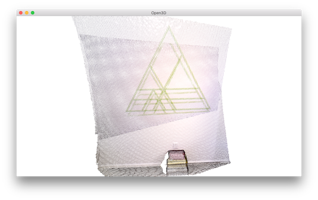
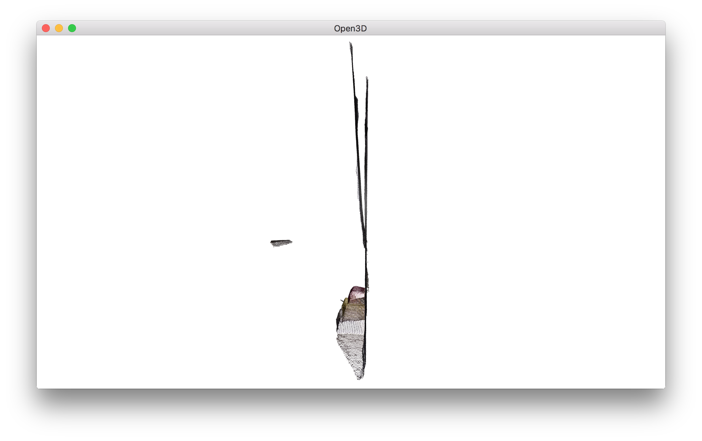
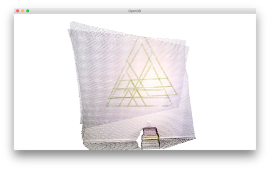
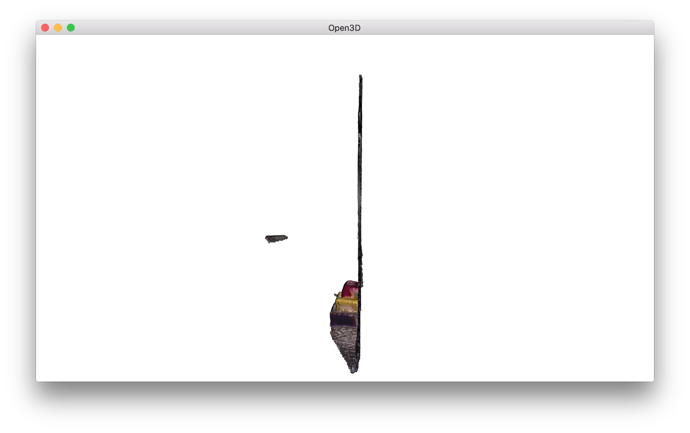
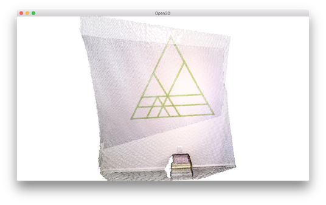
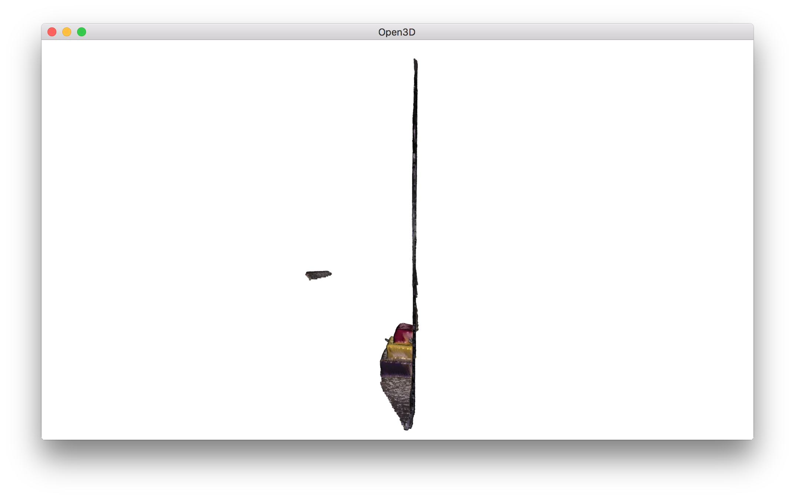

.. _colored_point_registration:

Colored point cloud registration
-------------------------------------

This tutorial demonstrates an ICP variant that uses both geometry and color for registration. It implements the algorithm of [Park2017]_. The color information locks the alignment along the tangent plane. Thus this algorithm is more accurate and more robust than prior point cloud registration algorithms, while the running speed is comparable to that of ICP registration. This tutorial uses notations from :ref:`icp_registration`.

.. literalinclude:: ../../../examples/Python/Advanced/colored_pointcloud_registration.py
   :language: python
   :lineno-start: 5
   :lines: 5-
   :linenos:

.. _visualize_color_alignment:

Helper visualization function
``````````````````````````````````````

.. literalinclude:: ../../../examples/Python/Advanced/colored_pointcloud_registration.py
   :language: python
   :lineno-start: 12
   :lines: 12-15
   :linenos:

In order to demonstrate the alignment between colored point clouds, ``draw_registration_result_original_color`` renders point clouds with their original color.

Input
```````````````

.. literalinclude:: ../../../examples/Python/Advanced/colored_pointcloud_registration.py
   :language: python
   :lineno-start: 20
   :lines: 20-27
   :linenos:

This script reads a source point cloud and a target point cloud from two files. An identity matrix is used as initialization.






.. _geometric_alignment:

Point-to-plane ICP
``````````````````````````````````````

.. literalinclude:: ../../../examples/Python/Advanced/colored_pointcloud_registration.py
   :language: python
   :lineno-start: 29
   :lines: 29-38
   :linenos:

We first run :ref:`point_to_plane_icp` as a baseline approach. The visualization below shows misaligned green triangle textures. This is because geometric constraint does not prevent two planar surfaces from slipping.






.. _multi_scale_geometric_color_alignment:

Colored point cloud registration
``````````````````````````````````````````````

The core function for colored point cloud registration is ``registration_colored_icp``. Following [Park2017]_, it runs ICP iterations (see :ref:`point_to_point_icp` for details) with a joint optimization objective

.. math:: E(\mathbf{T}) = (1-\delta)E_{C}(\mathbf{T}) + \delta E_{G}(\mathbf{T}),

where :math:`\mathbf{T}` is the transformation matrix to be estimated. :math:`E_{C}` and :math:`E_{G}` are the photometric and geometric terms, respectively. :math:`\delta\in[0,1]` is a weight parameter that has been determined empirically.

The geometric term :math:`E_{G}` is the same as the :ref:`point_to_plane_icp` objective

.. math:: E_{G}(\mathbf{T}) = \sum_{(\mathbf{p},\mathbf{q})\in\mathcal{K}}\big((\mathbf{p} - \mathbf{T}\mathbf{q})\cdot\mathbf{n}_{\mathbf{p}}\big)^{2},

where :math:`\mathcal{K}` is the correspondence set in the current iteration. :math:`\mathbf{n}_{\mathbf{p}}` is the normal of point :math:`\mathbf{p}`.

The color term :math:`E_{C}` measures the difference between the color of point :math:`\mathbf{q}` (denoted as :math:`C(\mathbf{q})`) and the color of its projection on the tangent plane of :math:`\mathbf{p}`.

.. math:: E_{C}(\mathbf{T}) = \sum_{(\mathbf{p},\mathbf{q})\in\mathcal{K}}\big(C_{\mathbf{p}}(\mathbf{f}(\mathbf{T}\mathbf{q})) - C(\mathbf{q})\big)^{2},

where :math:`C_{\mathbf{p}}(\cdot)` is a precomputed function continuously defined on the tangent plane of :math:`\mathbf{p}`. Function :math:`\mathbf{f}(\cdot)` projects a 3D point to the tangent plane. More details refer to [Park2017]_.

To further improve efficiency, [Park2017]_ proposes a multi-scale registration scheme. This has been implemented in the following script.

.. literalinclude:: ../../../examples/Python/Advanced/colored_pointcloud_registration.py
   :language: python
   :lineno-start: 40
   :lines: 40-72
   :linenos:

In total, 3 layers of multi-resolution point clouds are created with :ref:`voxel_downsampling`. Normals are computed with :ref:`vertex_normal_estimation`. The core registration function ``registration_colored_icp`` is called for each layer, from coarse to fine.  ``lambda_geometric`` is an optional argument for ``registration_colored_icp`` that determines :math:`\lambda \in [0,1]` in the overall energy :math:`\lambda E_{G} + (1-\lambda) E_{C}`.

The output is a tight alignment of the two point clouds. Notice the green triangles on the wall.




