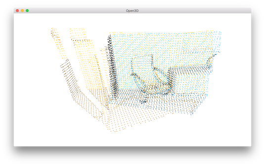

.. _fast_global_registration:

Fast global registration
-------------------------------------

RANSAC based :ref:`global_registration` solution may take a long time due to countless model proposal and evaluation.
[Zhou2016]_ introduced a faster approach that quickly optimizes line process weights of few correspondences.
As there is no model proposal and evaluation involved for each iteration, the approach proposed in [Zhou2016]_ can save a lot of computational time.

This script compares running time of RANSAC based :ref:`global_registration` and implementation of [Zhou2016]_.

.. code-block:: python

    # src/Python/Tutorial/Advanced/fast_global_registration.py

    from open3d import *
    from global_registration import *
    import numpy as np
    import copy

    import time

    def execute_fast_global_registration(source_down, target_down,
            source_fpfh, target_fpfh, voxel_size):
        distance_threshold = voxel_size * 0.5
        print(":: Apply fast global registration with distance threshold %.3f" \
                % distance_threshold)
        result = registration_fast_based_on_feature_matching(
                source_down, target_down, source_fpfh, target_fpfh,
                FastGlobalRegistrationOption(
                maximum_correspondence_distance = distance_threshold))
        return result

    if __name__ == "__main__":

        voxel_size = 0.05 # means 5cm for the dataset
        source, target, source_down, target_down, source_fpfh, target_fpfh = \
                prepare_dataset(voxel_size)

        start = time.time()
        result_ransac = execute_global_registration(source_down, target_down,
                source_fpfh, target_fpfh, voxel_size)
        print(result_ransac)
        print("Global registration took %.3f sec.\n" % (time.time() - start))
        draw_registration_result(source_down, target_down,
                result_ransac.transformation)

        start = time.time()
        result_fast = execute_fast_global_registration(source_down, target_down,
                source_fpfh, target_fpfh, voxel_size)
        print("Fast global registration took %.3f sec.\n" % (time.time() - start))
        draw_registration_result(source_down, target_down,
                result_fast.transformation)

Input
``````````````````````````````````````

.. code-block:: python

    voxel_size = 0.05 # means 5cm for the dataset
    source, target, source_down, target_down, source_fpfh, target_fpfh = \
            prepare_dataset(voxel_size)

For the pair comparison, the script reuses ``prepare_dataset`` function defined in :ref:`global_registration`.
It produces a pair of downsampled point clouds as well as FPFH features.

Baseline
``````````````````````````````````````

.. code-block:: python

    start = time.time()
    result_ransac = execute_global_registration(source_down, target_down,
            source_fpfh, target_fpfh, voxel_size)
    print(result_ransac)
    print("Global registration took %.3f sec.\n" % (time.time() - start))
    draw_registration_result(source_down, target_down,
            result_ransac.transformation)

This script calls RANSAC based :ref:`global_registration` as a baseline. After registration it displays the followings.



.. code-block:: shell

    RANSAC based global registration took 2.538 sec.

Fast global registration
``````````````````````````````````````

With the same input used for baseline, the next script calls the implementation of [Zhou2016]_.

.. code-block:: python

    # in execute_fast_global_registration function

    distance_threshold = voxel_size * 0.5
    print(":: Apply fast global registration with distance threshold %.3f" \
            % distance_threshold)
    result = registration_fast_based_on_feature_matching(
            source_down, target_down, source_fpfh, target_fpfh,
            FastGlobalRegistrationOption(
            maximum_correspondence_distance = distance_threshold))

This script displays the followings.

.. image:: ../../_static/Advanced/fast_global_registration/fgr.png
    :width: 400px

.. code-block:: shell

    Fast global registration took 0.193 sec.

With proper configuration, the accuracy of fast global registration is even comparable with ICP.
Please refer [Zhou2016]_ for more experimental results.
