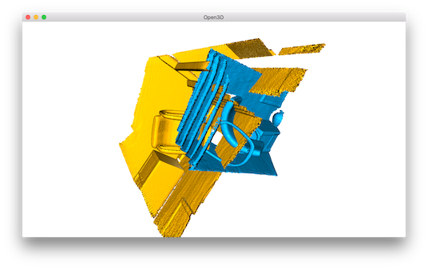
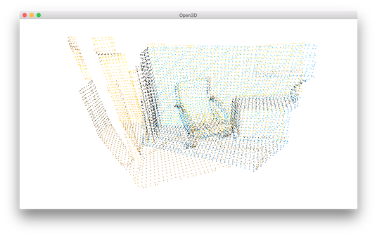
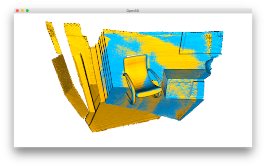

.. _global_registration:

Global registration
-------------------------------------

Both :ref:`icp_registration` and :ref:`colored_point_registration` are known as **local** registration methods because they rely on a rough alignment as initialization. This tutorial shows another class of registration methods, known as **global** registration. This family of algorithms do not require an alignment for initialization. They usually produce less tight alignment results and are used as initialization of the local methods.

.. literalinclude:: ../../../examples/Python/Advanced/global_registration.py
   :language: python
   :lineno-start: 5
   :lines: 5-
   :linenos:

Input
````````````````````````

.. literalinclude:: ../../../examples/Python/Advanced/global_registration.py
   :language: python
   :lineno-start: 39
   :lines: 39-50
   :linenos:

This script reads a source point cloud and a target point cloud from two files. They are misaligned with an identity matrix as transformation.



.. _extract_geometric_feature:

Extract geometric feature
``````````````````````````````````````

.. literalinclude:: ../../../examples/Python/Advanced/global_registration.py
   :language: python
   :lineno-start: 21
   :lines: 21-36
   :linenos:

We down sample the point cloud, estimate normals, then compute a FPFH feature for each point. The FPFH feature is a 33-dimensional vector that describes the local geometric property of a point. A nearest neighbor query in the 33-dimensinal space can return points with similar local geometric structures. See [Rasu2009]_ for details.

.. _feature_matching:

RANSAC
``````````````````````````````````````

.. literalinclude:: ../../../examples/Python/Advanced/global_registration.py
   :language: python
   :lineno-start: 53
   :lines: 52-65
   :linenos:

We use RANSAC for global registration. In each RANSAC iteration, ``ransac_n`` random points are picked from the source point cloud. Their corresponding points in the target point cloud are detected by querying the nearest neighbor in the 33-dimensional FPFH feature space. A pruning step takes fast pruning algorithms  to quickly reject false matches early.

Open3D provides the following pruning algorithms:

- ``CorrespondenceCheckerBasedOnDistance`` checks if aligned point clouds are close (less than specified threshold).
- ``CorrespondenceCheckerBasedOnEdgeLength`` checks if the lengths of any two arbitrary edges (line formed by two vertices) individually drawn from source and target correspondences are similar. This tutorial checks that :math:`||edge_{source}|| > 0.9 \times ||edge_{target}||` and :math:`||edge_{target}|| > 0.9 \times ||edge_{source}||` are true.
- ``CorrespondenceCheckerBasedOnNormal`` considers vertex normal affinity of any correspondences. It computes dot product of two normal vectors. It takes radian value for the threshold.

Only matches that pass the pruning step are used to compute a transformation, which is validated on the entire point cloud. The core function is ``registration_ransac_based_on_feature_matching``. The most important hyperparameter of this function is ``RANSACConvergenceCriteria``. It defines the maximum number of RANSAC iterations and the maximum number of validation steps. The larger these two numbers are, the more accurate the result is, but also the more time the algorithm takes.

We set the RANSAC parameters based on the empirical value provided by [Choi2015]_. The result is



.. Note:: Open3D provides faster implementation for global registration. Please refer :ref:`fast_global_registration`.

.. _local_refinement:

Local refinement
``````````````````````````````````````

For performance reason, the global registration is only performed on a heavily down-sampled point cloud. The result is also not tight. We use :ref:`point_to_plane_icp` to further refine the alignment.

.. literalinclude:: ../../../examples/Python/Advanced/global_registration.py
   :language: python
   :lineno-start: 69
   :lines: 68-76
   :linenos:

Outputs a tight alignment. This summarizes a complete pairwise registration workflow.


