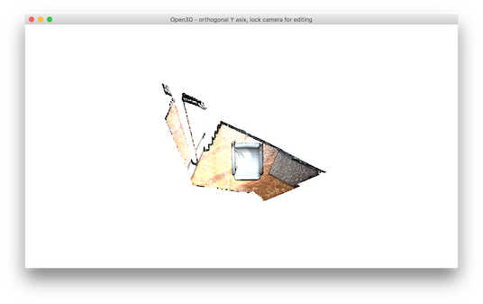
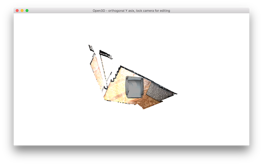
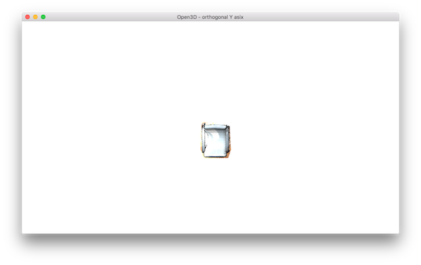
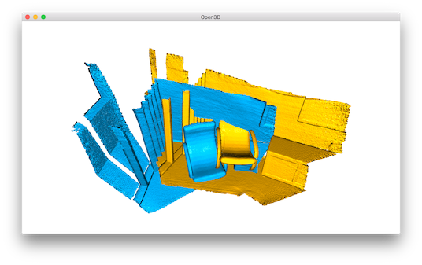

.. _interactive_visualization:

Interactive visualization
-------------------------------------

This tutorial introduces user interaction features of visualizer window.

.. code-block:: python

    # src/Python/Tutorial/Advanced/interactive_visualization.py

    import numpy as np
    import copy
    from open3d import *

    def demo_crop_geometry():
        print("Demo for manual geometry cropping")
        print("1) Press 'Y' twice to align geometry with positive direction of y-axis")
        print("2) Press 'K' to lock screen and to switch to selection mode")
        print("3) Drag for rectangle selection,")
        print("   or use ctrl + left click for polygon selection")
        print("4) Press 'C' to get a selected geometry and to save it")
        print("5) Press 'F' to switch to freeview mode")
        pcd = read_point_cloud("../../TestData/ICP/cloud_bin_0.pcd")
        draw_geometries_with_editing([pcd])

    def draw_registration_result(source, target, transformation):
        source_temp = copy.deepcopy(source)
        target_temp = copy.deepcopy(target)
        source_temp.paint_uniform_color([1, 0.706, 0])
        target_temp.paint_uniform_color([0, 0.651, 0.929])
        source_temp.transform(transformation)
        draw_geometries([source_temp, target_temp])

    def pick_points(pcd):
        print("")
        print("1) Please pick at least three correspondences using [shift + left click]")
        print("   Press [shift + right click] to undo point picking")
        print("2) Afther picking points, press q for close the window")
        vis = VisualizerWithEditing()
        vis.create_window()
        vis.add_geometry(pcd)
        vis.run() # user picks points
        vis.destroy_window()
        print("")
        return vis.get_picked_points()

    def demo_manual_registration():
        print("Demo for manual ICP")
        source = read_point_cloud("../../TestData/ICP/cloud_bin_0.pcd")
        target = read_point_cloud("../../TestData/ICP/cloud_bin_2.pcd")
        print("Visualization of two point clouds before manual alignment")
        draw_registration_result(source, target, np.identity(4))

        # pick points from two point clouds and builds correspondences
        picked_id_source = pick_points(source)
        picked_id_target = pick_points(target)
        assert(len(picked_id_source)>=3 and len(picked_id_target)>=3)
        assert(len(picked_id_source) == len(picked_id_target))
        corr = np.zeros((len(picked_id_source),2))
        corr[:,0] = picked_id_source
        corr[:,1] = picked_id_target

        # estimate rough transformation using correspondences
        print("Compute a rough transform using the correspondences given by user")
        p2p = TransformationEstimationPointToPoint()
        trans_init = p2p.compute_transformation(source, target,
                 Vector2iVector(corr))

        # point-to-point ICP for refinement
        print("Perform point-to-point ICP refinement")
        threshold = 0.03 # 3cm distance threshold
        reg_p2p = registration_icp(source, target, threshold, trans_init,
                TransformationEstimationPointToPoint())
        draw_registration_result(source, target, reg_p2p.transformation)
        print("")

    if __name__ == "__main__":
        demo_crop_geometry()
        demo_manual_registration()

This script executes two applications of user interaction: ``demo_crop_geometry()`` and ``demo_manual_registration()``.

.. _crop_geometry:

Crop geometry
``````````````````````````````````````

.. code-block:: python

    def demo_crop_geometry():
        print("Demo for manual geometry cropping")
        print("1) Press 'Y' twice to align geometry with negative direction of y-axis")
        print("2) Press 'K' to lock screen and to switch to selection mode")
        print("3) Drag for rectangle selection,")
        print("   or use ctrl + left click for polygon selection")
        print("4) Press 'C' to get a selected geometry and to save it")
        print("5) Press 'F' to switch to freeview mode")
        pcd = read_point_cloud("../../TestData/ICP/cloud_bin_0.pcd")
        draw_geometries_with_editing([pcd])

This function simply reads a point cloud and calls ``draw_geometries_with_editing``. This function provides vertex selection and cropping.

.. Note:: Open3D has ``VisualizerWithEditing`` class that inherits ``Visualizer`` class. It adds graphic user interaction feature. Likewise examples in :ref:`customized_visualization`, ``VisualizerWithEditing()`` can be explicitly used instead ``draw_geometries_with_editing([pcd])``.

Once a geometry is displayed, press ``Y`` twice to align geometry with negative direction of y-axis. After adjusting viewing orientation, press ``K`` to lock screen and to switch to the selection mode.



.. Tip:: The practical step for selecting area is to align the geometry with arbitrary axis using orthographic projection model. This trick makes selection easier, because it avoids self-occlusion hassle due to perspective projection.

To select a region, use either ``mouse drag`` (rectangle selection) or ``ctrl + left mouse click`` (polygon selection). The below example shows a selected area using a polygon.



Note that the selected area is dark shaded. To keep the selected area and discard the rest, press ``C``. It pops up a dialog box to save cropped geometry. Cropping result is shown after saving.

.. image:: ../../_static/Advanced/interactive_visualization/crop_save.png
    :width: 200px



To finish selection mode, press ``F`` to switch to freeview mode.

.. image:: ../../_static/Advanced/interactive_visualization/crop_freeview.png
    :width: 400px

.. _manual_registration:

Manual registration
`````````````````````````````````````````````

Select correspondences
=====================================

The following script register two point clouds using point-to-point ICP. It gets initial alignment via user interaction.

.. code-block:: python

    def demo_manual_registration():
        print("Demo for manual ICP")
        source = read_point_cloud("../../TestData/ICP/cloud_bin_0.pcd")
        target = read_point_cloud("../../TestData/ICP/cloud_bin_2.pcd")
        print("Visualization of two point clouds before manual alignment")
        draw_registration_result(source, target, np.identity(4))

        # pick points from two point clouds and builds correspondences
        picked_id_source = pick_points(source)
        picked_id_target = pick_points(target)
        :

The script reads two point clouds, and visualize the point clouds before alignment.



.. code-block:: python

    def pick_points(pcd):
        print("")
        print("1) Please pick at least three correspondences using [shift + left click]")
        print("   Press [shift + right click] to undo point picking")
        print("2) Afther picking points, press q for close the window")
        vis = VisualizerWithEditing()
        vis.create_window()
        vis.add_geometry(pcd)
        vis.run() # user picks points
        vis.destroy_window()
        print("")
        return vis.get_picked_points()

Function ``pick_points(pcd)`` makes an instance of ``VisualizerWithEditing``. To mimic ``draw_geometries``, it creates windows, adds geometry, visualize geometry, and terminates. A novel interface function from ``VisualizerWithEditing`` is ``get_picked_points()`` that returns the indices of user-picked vertices.

To pick a vertex, press ``shift + left click`` on a window. If a vertex is selected, the visualizer window overlays a sphere on a selected vertex. For example, after picking three vertices in the source point cloud, it shows:

.. image:: ../../_static/Advanced/interactive_visualization/manual_icp_source.png
    :width: 400px

This will print:

.. code-block:: sh

    Picked point #58481 (2.14, 1.56, 1.53) to add in queue.
    Picked point #77321 (2.86, 1.92, 1.09) to add in queue.
    Picked point #42639 (3.28, 1.53, 1.45) to add in queue.

Press ``q`` to close window. The next step is to pick the same correspondences in the target point cloud. The color of sphere helps to identify the same correspondence.

.. image:: ../../_static/Advanced/interactive_visualization/manual_icp_target.png
    :width: 400px

This will print:

.. code-block:: sh

    Picked point #54028 (1.62, 1.81, 1.23) to add in queue.
    Picked point #97115 (2.45, 2.19, 1.11) to add in queue.
    Picked point #47467 (2.75, 1.71, 1.45) to add in queue.

.. Tip:: To get a good registration result, try to pick more than three points that are well-distributed in the scene. Using a vertex on the corner region is a good way to easily pick the right correspondence.

Registration using user correspondences
=======================================

.. code-block:: python

    def demo_manual_registration():
        :
        assert(len(picked_id_source)>=3 and len(picked_id_target)>=3)
        assert(len(picked_id_source) == len(picked_id_target))
        corr = np.zeros((len(picked_id_source),2))
        corr[:,0] = picked_id_source
        corr[:,1] = picked_id_target

        # estimate rough transformation using correspondences
        print("Compute a rough transform using the correspondences given by user")
        p2p = TransformationEstimationPointToPoint()
        trans_init = p2p.compute_transformation(source, target,
                 Vector2iVector(corr))

        # point-to-point ICP for refinement
        print("Perform point-to-point ICP refinement")
        threshold = 0.03 # 3cm distance threshold
        reg_p2p = registration_icp(source, target, threshold, trans_init,
                TransformationEstimationPointToPoint())
        draw_registration_result(source, target, reg_p2p.transformation)
        print("")

The later part of the demo computes an initial transformation based on the user-provided correspondences. This script builds pairs of correspondences using ``Vector2iVector(corr)``. It utilizes ``TransformationEstimationPointToPoint.compute_transformation`` to compute the initial transformation from the correspondences. The initial transformation is refined using ``registration_icp``.

The registration result follows:

.. image:: ../../_static/Advanced/interactive_visualization/manual_icp_alignment.png
    :width: 400px
