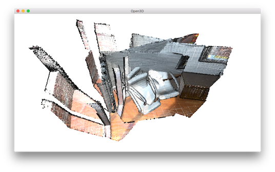
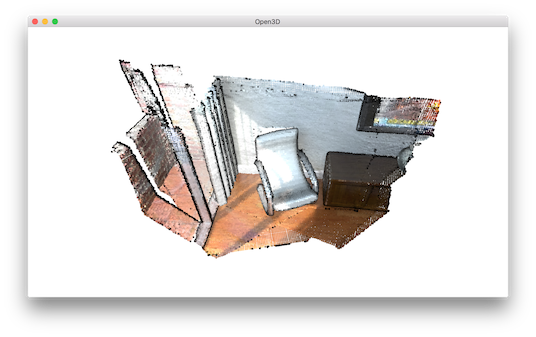

.. _multiway_registration:

Multiway Registration
-------------------------------------

Multiway registration is the process to align multiple pieces of geometry in a global space. Typically, the input is a set of geometries (e.g., point clouds or RGBD images) :math:`\{\mathbf{P}_{i}\}`. The output is a set of rigid transformations :math:`\{\mathbf{T}_{i}\}`, so that the transformed point clouds :math:`\{\mathbf{T}_{i}\mathbf{P}_{i}\}` are aligned in the global space.

Open3D implements multiway registration via pose graph optimization. The backend implements the technique presented in [Choi2015]_.

.. code-block:: python

    # src/Python/Tutorial/Advanced/multiway_registration.py

    import sys
    sys.path.append("../..")
    from py3d import *

    if __name__ == "__main__":

        set_verbosity_level(VerbosityLevel.Debug)
        pcds = []
        for i in range(3):
            pcd = read_point_cloud(
                    "../../TestData/ICP/cloud_bin_%d.pcd" % i)
            downpcd = voxel_down_sample(pcd, voxel_size = 0.02)
            pcds.append(downpcd)
        draw_geometries(pcds)

        pose_graph = PoseGraph()
        odometry = np.identity(4)
        pose_graph.nodes.append(PoseGraphNode(odometry))

        n_pcds = len(pcds)
        for source_id in range(n_pcds):
            for target_id in range(source_id + 1, n_pcds):
                source = pcds[source_id]
                target = pcds[target_id]

                print("Apply point-to-plane ICP")
                icp_coarse = registration_icp(source, target, 0.3,
                        np.identity(4),
                        TransformationEstimationPointToPlane())
                icp_fine = registration_icp(source, target, 0.03,
                        icp_coarse.transformation,
                        TransformationEstimationPointToPlane())
                transformation_icp = icp_fine.transformation
                information_icp = get_information_matrix_from_point_clouds(
                        source, target, 0.03, icp_fine.transformation)
                print(transformation_icp)

                # draw_registration_result(source, target, np.identity(4))
                print("Build PoseGraph")
                if target_id == source_id + 1: # odometry case
                    odometry = np.dot(transformation_icp, odometry)
                    pose_graph.nodes.append(
                            PoseGraphNode(np.linalg.inv(odometry)))
                    pose_graph.edges.append(
                            PoseGraphEdge(source_id, target_id,
                            transformation_icp, information_icp, uncertain = False))
                else: # loop closure case
                    pose_graph.edges.append(
                            PoseGraphEdge(source_id, target_id,
                            transformation_icp, information_icp, uncertain = True))

        print("Optimizing PoseGraph ...")
        option = GlobalOptimizationOption(
                max_correspondence_distance = 0.03,
                edge_prune_threshold = 0.25,
                reference_node = 0)
        global_optimization(pose_graph,
                GlobalOptimizationLevenbergMarquardt(),
                GlobalOptimizationConvergenceCriteria(), option)

        print("Transform points and display")
        for point_id in range(n_pcds):
            print(pose_graph.nodes[point_id].pose)
            pcds[point_id].transform(pose_graph.nodes[point_id].pose)
        draw_geometries(pcds)

Input
````````````````````

.. code-block:: python

    set_verbosity_level(VerbosityLevel.Debug)
    pcds = []
    for i in range(3):
        pcd = read_point_cloud(
                "../../TestData/ICP/cloud_bin_%d.pcd" % i)
        downpcd = voxel_down_sample(pcd, voxel_size = 0.02)
        pcds.append(downpcd)
    draw_geometries(pcds)

The first part of the tutorial script reads three point clouds from files. The point clouds are downsampled and visualized together. They are misaligned.



.. _build_a_posegraph:

Build a pose graph
``````````````````````````````````````

.. code-block:: python

    pose_graph = PoseGraph()
    odometry = np.identity(4)
    pose_graph.nodes.append(PoseGraphNode(odometry))

    n_pcds = len(pcds)
    for source_id in range(n_pcds):
        for target_id in range(source_id + 1, n_pcds):
            source = pcds[source_id]
            target = pcds[target_id]

            print("Apply point-to-plane ICP")
            icp_coarse = registration_icp(source, target, 0.3,
                    np.identity(4),
                    TransformationEstimationPointToPlane())
            icp_fine = registration_icp(source, target, 0.03,
                    icp_coarse.transformation,
                    TransformationEstimationPointToPlane())
            transformation_icp = icp_fine.transformation
            information_icp = get_information_matrix_from_point_clouds(
                    source, target, 0.03, icp_fine.transformation)
            print(transformation_icp)

            # draw_registration_result(source, target, np.identity(4))
            print("Build PoseGraph")
            if target_id == source_id + 1: # odometry case
                odometry = np.dot(transformation_icp, odometry)
                pose_graph.nodes.append(
                        PoseGraphNode(np.linalg.inv(odometry)))
                pose_graph.edges.append(
                        PoseGraphEdge(source_id, target_id,
                        transformation_icp, information_icp, uncertain = False))
            else: # loop closure case
                pose_graph.edges.append(
                        PoseGraphEdge(source_id, target_id,
                        transformation_icp, information_icp, uncertain = True))

A pose graph has two key elements: nodes and edges. A node is a piece of geometry :math:`\mathbf{P}_{i}` associated with a pose matrix :math:`\mathbf{T}_{i}` which transforms :math:`\mathbf{P}_{i}` into the global space. The set :math:`\{\mathbf{T}_{i}\}` are the unknown variables to be optimized. ``PoseGraph.nodes`` is a list of ``PoseGraphNode``. We set the global space to be the space of :math:`\mathbf{P}_{0}`. Thus :math:`\mathbf{T}_{0}` is identity matrix. The other pose matrices are initialized by accumulating transformation between neighboring nodes. The neighboring nodes usually have large overlap and can be registered with :ref:`point_to_plane_icp`.

A pose graph edge connects two nodes (pieces of geometry) that overlap. Each edge contains a transformation matrix :math:`\mathbf{T}_{i,j}` that aligns the source geometry :math:`\mathbf{P}_{i}` to the target geometry :math:`\mathbf{P}_{j}`. This tutorial uses :ref:`point_to_plane_icp` to estimate the transformation. In more complicated cases, this pairwise registration problem should be solved via :ref:`global_registration`.

[Choi2015]_ has observed that pairwise registration is error-prone. False pairwise alignments can outnumber correctly
aligned pairs. Thus, they partition pose graph edges into two classes. **Odometry edges** connect temporally close, neighboring nodes. A local registration algorithm such as ICP can reliably align them. **Loop closure edges** connect any non-neighboring nodes. The alignment is found by global registration and is less reliable. In Open3D, these two classes of edges are distinguished by the ``uncertain`` parameter in the initializer of ``PoseGraphEdge``.

In addition to the transformation matrix :math:`\mathbf{T}_{i}`, the user can set an information matrix :math:`\mathbf{\Lambda}_{i}` for each edge. If :math:`\mathbf{\Lambda}_{i}` is set using function ``get_information_matrix_from_point_clouds``, the loss on this pose graph edge approximates the RMSE of the corresponding sets between the two nodes. Refer to [Choi2015]_ and `the Redwood registration benchmark <http://redwood-data.org/indoor/registration.html>`_ for details.

The script creates a pose graph with three nodes and three edges. Among the edges, two of them are odometry edges (``uncertain = False``) and one is a loop closure edge (``uncertain = True``).

.. _optimize_a_posegraph:

Optimize a pose graph
``````````````````````````````````````

.. code-block:: python

    print("Optimizing PoseGraph ...")
    option = GlobalOptimizationOption(
            max_correspondence_distance = 0.03,
            edge_prune_threshold = 0.25,
            reference_node = 0)
    global_optimization(pose_graph,
            GlobalOptimizationLevenbergMarquardt(),
            GlobalOptimizationConvergenceCriteria(), option)

Open3D uses function ``global_optimization`` to perform pose graph optimization. Two types of optimization methods can be chosen: ``GlobalOptimizationGaussNewton`` or ``GlobalOptimizationLevenbergMarquardt``. The latter is recommended since it has better convergence property. Class ``GlobalOptimizationConvergenceCriteria`` can be used to set the maximum number of iterations and various optimization parameters. Class ``GlobalOptimizationOption`` defines the loss function of the pose graph.

.. code-block:: sh

	Optimizing PoseGraph ...
	[GlobalOptimizationLM] Optimizing PoseGraph having 3 nodes and 3 edges.
	Line process weight : 3.745800
	[Initial     ] residual : 6.741225e+00, lambda : 6.042803e-01
	[Iteration 00] residual : 1.791471e+00, valid edges : 3, time : 0.000 sec.
	[Iteration 01] residual : 5.133682e-01, valid edges : 3, time : 0.000 sec.
	[Iteration 02] residual : 4.412544e-01, valid edges : 3, time : 0.000 sec.
	[Iteration 03] residual : 4.408356e-01, valid edges : 3, time : 0.000 sec.
	[Iteration 04] residual : 4.408342e-01, valid edges : 3, time : 0.000 sec.
	Delta.norm() < 1.000000e-06 * (x.norm() + 1.000000e-06)
	[GlobalOptimizationLM] total time : 0.000 sec.
	[GlobalOptimizationLM] Optimizing PoseGraph having 3 nodes and 3 edges.
	Line process weight : 3.745800
	[Initial     ] residual : 4.408342e-01, lambda : 6.064910e-01
	Delta.norm() < 1.000000e-06 * (x.norm() + 1.000000e-06)
	[GlobalOptimizationLM] total time : 0.000 sec.
	CompensateReferencePoseGraphNode : reference : 0

The global optimization performs twice on the pose graph. The first pass optimizes poses for the original pose graph taking all edges into account and does its best to distinguish false alignments among uncertain edges. These false alignments are pruned after the first pass. The second pass runs without them and produces a tight global alignment. In this example, all the edges are considered as true alignments, hence the second pass did nothing.

.. _visualize_optimization:

Visualize optimization
``````````````````````````````````````

.. code-block:: python

    print("Transform points and display")
    for point_id in range(n_pcds):
        print(pose_graph.nodes[point_id].pose)
        pcds[point_id].transform(pose_graph.nodes[point_id].pose)
    draw_geometries(pcds)

Ouputs:



Although this tutorial demonstrates multiway registration for point clouds. The same procedure can be applied to RGBD images. See :ref:`reconstruction_system_make_fragments` for an example.
