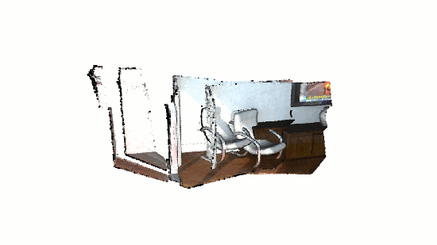

.. _non_blocking_visualization:

Non-blocking visualization
-------------------------------------

``draw_geometries()`` is a useful function for quick overview of static geometries. However, this function holds process until a visualization window is closed. This is not optimal when geometry is updated and need to be visualized without closing the window. This tutorial introduces an example to customize the rendering loop.

Review draw_geometries
````````````````````````````````````````````````````

``draw_geometries()`` has the following rendering-loop (see ``Visualizer::Run()`` for the c++ implementation):

.. code-block:: bash

    while(true):
        if (geometry has changed):
            re-bind geometry to shaders
        if (view parameters have changed):
            re-render the scene
        if (any user mouse/keyboard input):
            respond to it and set flags for re-rendering

Note that both binding geometry and rendering are costly operations, thus they are executed in a lazy way. There are two flags control them individually. Function ``update_geometry()`` and ``update_renderer()`` set these flags to dirty individually. After rebinding/rendering, these flags are cleared once again.

This rendering loop can be readily customized. For example, a custom loop can be made in this way to visualize ICP registration:

.. code-block:: python

    vis = Visualizer()
    vis.create_window()
    for i in range(icp_iteration):
        # do ICP single iteration
        # transform geometry using ICP
        vis.update_geometry()
        vis.reset_view_point(True)
        vis.poll_events()
        vis.update_renderer()

The full script implementing this idea is displayed below.

.. code-block:: python

    # src/Python/Tutorial/Advanced/non_blocking_visualization.py

    from open3d import *
    import numpy as np
    import copy

    if __name__ == "__main__":
        set_verbosity_level(VerbosityLevel.Debug)
        source_raw = read_point_cloud("../../TestData/ICP/cloud_bin_0.pcd")
        target_raw = read_point_cloud("../../TestData/ICP/cloud_bin_1.pcd")
        source = voxel_down_sample(source_raw, voxel_size = 0.02)
        target = voxel_down_sample(target_raw, voxel_size = 0.02)
        trans = [[0.862, 0.011, -0.507,  0.0],
                [-0.139, 0.967, -0.215,  0.7],
                [0.487, 0.255,  0.835, -1.4],
                [0.0, 0.0, 0.0, 1.0]]
        source.transform(trans)

        flip_transform = [[1, 0, 0, 0],
                [0, -1, 0, 0],
                [0, 0, -1, 0],
                [0, 0, 0, 1]]
        source.transform(flip_transform)
        target.transform(flip_transform)

        vis = Visualizer()
        vis.create_window()
        vis.add_geometry(source)
        vis.add_geometry(target)
        threshold = 0.05
        icp_iteration = 100
        save_image = False

        for i in range(icp_iteration):
            reg_p2l = registration_icp(source, target, threshold,
                    np.identity(4), TransformationEstimationPointToPlane(),
                    ICPConvergenceCriteria(max_iteration = 1))
            source.transform(reg_p2l.transformation)
            vis.update_geometry()
            vis.reset_view_point(True)
            vis.poll_events()
            vis.update_renderer()
            if save_image:
                vis.capture_screen_image("temp_%04d.jpg" % i)
        vis.destroy_window()

The following sections explain this script.

Prepare example data
````````````````````````````````````````````````````
.. code-block:: python

    set_verbosity_level(VerbosityLevel.Debug)
    source_raw = read_point_cloud("../../TestData/ICP/cloud_bin_0.pcd")
    target_raw = read_point_cloud("../../TestData/ICP/cloud_bin_1.pcd")
    source = voxel_down_sample(source_raw, voxel_size = 0.02)
    target = voxel_down_sample(target_raw, voxel_size = 0.02)
    trans = [[0.862, 0.011, -0.507,  0.0],
            [-0.139, 0.967, -0.215,  0.7],
            [0.487, 0.255,  0.835, -1.4],
            [0.0, 0.0, 0.0, 1.0]]
    source.transform(trans)

    flip_transform = [[1, 0, 0, 0],
            [0, -1, 0, 0],
            [0, 0, -1, 0],
            [0, 0, 0, 1]]
    source.transform(flip_transform)
    target.transform(flip_transform)

This part reads two point clouds and downsamples them. The source point cloud is intentionally transformed for the misalignment. Both point clouds are flipped for better visualization.


Initialize Visualizer class
````````````````````````````````````````````````````

.. code-block:: python

    vis = Visualizer()
    vis.create_window()
    vis.add_geometry(source)
    vis.add_geometry(target)

These lines make an instance of visualizer class, open a visualizer window, and add two geometries to the visualizer.

Transform geometry and visualize it
````````````````````````````````````````````````````

.. code-block:: python

    threshold = 0.05
    icp_iteration = 100
    save_image = False

    for i in range(icp_iteration):
        reg_p2l = registration_icp(source, target, threshold,
                np.identity(4), TransformationEstimationPointToPlane(),
                ICPConvergenceCriteria(max_iteration = 1))
        source.transform(reg_p2l.transformation)
        vis.update_geometry()
        vis.reset_view_point(True)
        vis.poll_events()
        vis.update_renderer()
        if save_image:
            vis.capture_screen_image("temp_%04d.jpg" % i)
    vis.destroy_window()

This script calls ``registration_icp`` for every iteration. Note that it explicitly forces only one ICP iteration via ``ICPConvergenceCriteria(max_iteration = 1)``. This is a trick to retrieve a slight pose update from a single ICP iteration. After ICP, source geometry is transformed accordingly.

The next part of the script is the core of this tutorial. ``update_geometry`` informs any geometries in ``vis`` are updated. ``reset_view_point`` updates the current view point based on the updated geometries. Finally, visualizer renders a new frame by calling ``poll_events`` and ``update_renderer``. After for-loop iterations, ``destroy_window`` closes the window.

The result looks like below.


