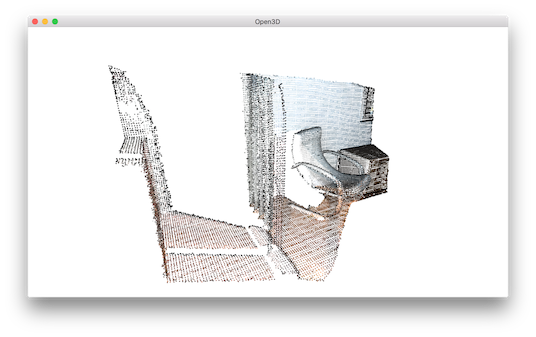
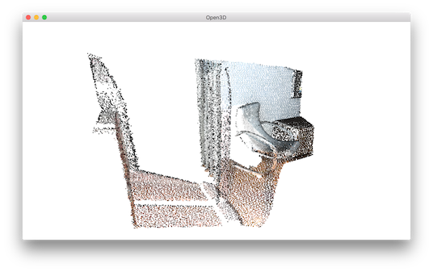
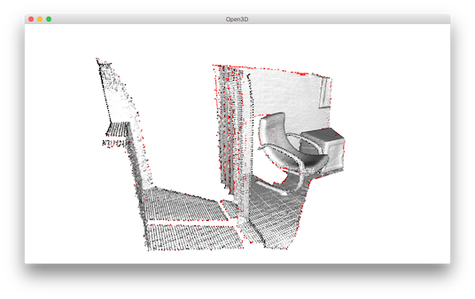
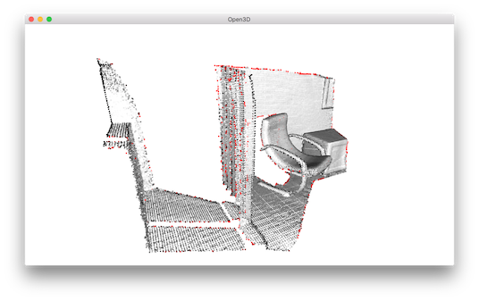

.. _pointclud_outlier_removal:

Point cloud outlier removal
-------------------------------------

When collecting data from scanning devices, it happens that the point cloud contains noise
and artifact that one would like to remove. This tutorial address outlier removal feature.

.. literalinclude:: ../../../examples/Python/Advanced/pointcloud_outlier_removal.py
   :language: python
   :lineno-start: 5
   :lines: 5-41
   :linenos:

Prepare input data
=====================================

A point cloud is loaded and downsampled using ``voxel_downsample``.

.. literalinclude:: ../../../examples/Python/Advanced/pointcloud_outlier_removal.py
   :language: python
   :lineno-start: 21
   :lines: 21-27
   :linenos:

For comparison, ``uniform_down_sample`` can downsample point cloud by collecting every n-th points.

.. literalinclude:: ../../../examples/Python/Advanced/pointcloud_outlier_removal.py
   :language: python
   :lineno-start: 29
   :lines: 29-31
   :linenos:

Select down sample
=====================================

The helper function uses ``select_down_sample`` that takes binary mask to output only the selected points.
The selected points and the non-selected points are visualized.

.. literalinclude:: ../../../examples/Python/Advanced/pointcloud_outlier_removal.py
   :language: python
   :lineno-start: 9
   :lines: 9-16
   :linenos:

Statistical outlier removal
=====================================

.. literalinclude:: ../../../examples/Python/Advanced/pointcloud_outlier_removal.py
   :language: python
   :lineno-start: 33
   :lines: 33-36
   :linenos:

``statistical_outlier_removal`` removes points that are further away from their neighbors compared to the average for the point cloud. It takes two input parameters:

    + ``nb_neighbors`` allows to specify how many neighbors are taken into account in order to calculate the average distance for a given point.
    + ``std_ratio`` allows to set the threshold level based on the standard deviation of the average distances across the point cloud. The lower this number the more aggressive the filter will be.

Radius outlier removal
=====================================

.. literalinclude:: ../../../examples/Python/Advanced/pointcloud_outlier_removal.py
   :language: python
   :lineno-start: 38
   :lines: 38-41
   :linenos:

``radius_outlier_removal`` removes points that have few neighbors in a given sphere around them. Two parameters can be used to tune the filter to your data:

    + ``nb_points`` lets you pick the minimum amount of points that the sphere should contain
    + ``radius`` defines the radius of the sphere that will be used for counting the neighbors.

