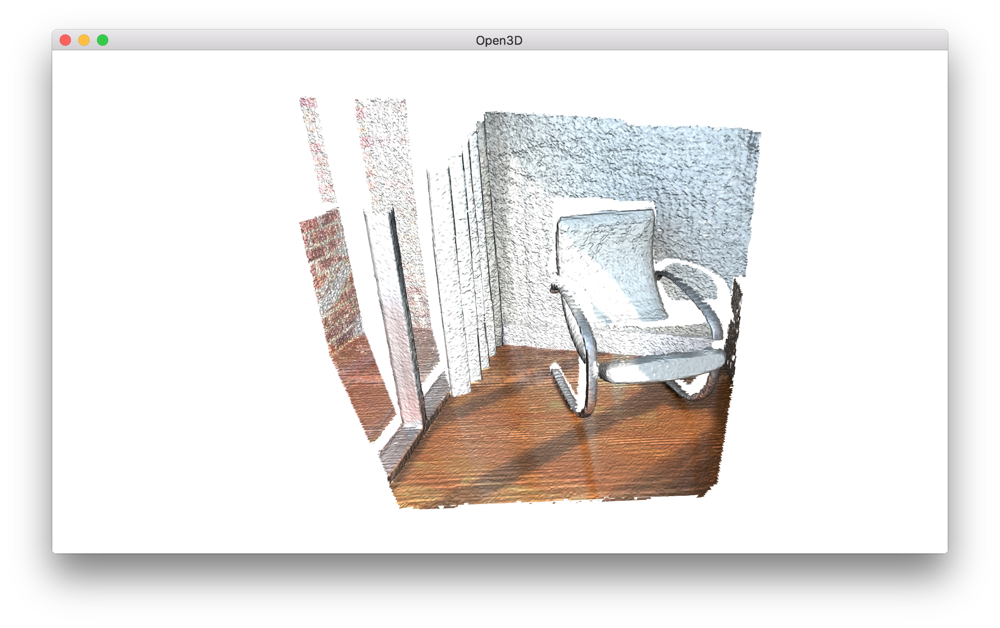

.. _rgbd_integration:

RGBD integration
-------------------------------------

Open3D implements a scalable RGBD image integration algorithm. The algorithm is based on the technique presented in [Curless1996]_ and [Newcombe2011]_. In order to support large scenes, we use a hierarchical hashing structure introduced in `Integrater in ElasticReconstruction <https://github.com/qianyizh/ElasticReconstruction/tree/master/Integrate>`_.

.. literalinclude:: ../../../examples/Python/Advanced/rgbd_integration.py
   :language: python
   :lineno-start: 5
   :lines: 5-
   :linenos:

.. _log_file_format:

Read trajectory from .log file
``````````````````````````````````````

.. literalinclude:: ../../../examples/Python/Advanced/rgbd_integration.py
   :language: python
   :lineno-start: 12
   :lines: 12
   :linenos:

This tutorial uses function ``read_trajectory`` to read a camera trajectory from `a .log file <http://redwood-data.org/indoor/fileformat.html>`_. A sample .log file is as follows.

.. code-block:: sh

    # examples/TestData/RGBD/odometry.log
    0   0   1
    1   0   0   2
    0   1   0   2
    0   0   1 -0.3
    0   0   0   1
    1   1   2
    0.999988  3.08668e-005  0.0049181  1.99962
    -8.84184e-005  0.999932  0.0117022  1.97704
    -0.0049174  -0.0117024  0.999919  -0.300486
    0  0  0  1
    :

.. _tsdf_volume_integration:

TSDF volume integration
``````````````````````````````````````

.. literalinclude:: ../../../examples/Python/Advanced/rgbd_integration.py
   :language: python
   :lineno-start: 13
   :lines: 13-30
   :linenos:

Open3D provides two types of TSDF volumes: ``UniformTSDFVolume`` and ``ScalableTSDFVolume``. The latter is recommended since it uses a hierarchical structure and thus supports larger scenes.

``ScalableTSDFVolume`` has several parameters. ``voxel_length = 4.0 / 512.0`` means a single voxel size for TSDF volume is  :math:`\frac{4.0m}{512.0} = 7.8125mm`. Lowering this value makes a high-resolution TSDF volume, but the integration result can be susceptible to depth noise. ``sdf_trunc = 0.04`` specifies truncation value for signed distance function (SDF). When ``color_type = TSDFVolumeColorType.RGB8``, 8 bit RGB color is also integrated as part of the TSDF volume. Float type intensity can be integrated with ``color_type = TSDFVolumeColorType.Gray32`` and ``convert_rgb_to_intensity = True``. The color integration is inspired by `PCL <http://pointclouds.org/>`_.

.. _extract_a_mesh:

Extract a mesh
``````````````````````````````````````

Mesh extraction uses the marching cubes algorithm [LorensenAndCline1987]_.

.. literalinclude:: ../../../examples/Python/Advanced/rgbd_integration.py
   :language: python
   :lineno-start: 32
   :lines: 32-35
   :linenos:

Outputs:



.. Note:: TSDF volume works like weighted average filter in 3D space. If more frames are integrated, the volume produces smoother and nicer mesh. Please check :ref:`reconstruction_system_make_fragments` for more examples.
