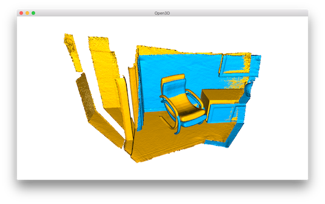
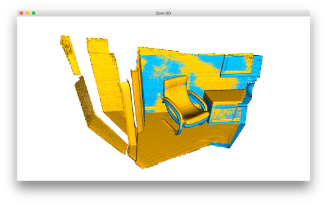
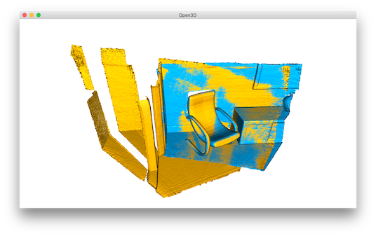
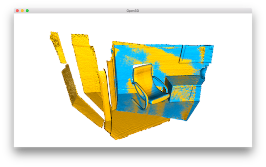

.. _icp_registration:

ICP Registration
-------------------------------------

This tutorial demonstrates the ICP (Iterative Closest Point) registration algorithm. It  has been a mainstay of geometric registration in both research and industry for many years. The input are two point clouds and an initial transformation that roughly aligns the source point cloud to the target point cloud. The output is a refined transformation that tightly aligns the two point clouds. A helper function ``draw_registration_result`` visualizes the alignment during the registration process. In this tutorial, we show two ICP variants, the point-to-point ICP and the point-to-plane ICP [Rusinkiewicz2001]_.

.. code-block:: python

    # src/Python/Tutorial/Basic/icp_registration.py

    def draw_registration_result(source, target, transformation):
        source_temp = copy.deepcopy(source)
        target_temp = copy.deepcopy(target)
        source_temp.paint_uniform_color([1, 0.706, 0])
        target_temp.paint_uniform_color([0, 0.651, 0.929])
        source_temp.transform(transformation)
        draw_geometries([source_temp, target_temp])

    if __name__ == "__main__":
        source = read_point_cloud("../../TestData/ICP/cloud_bin_0.pcd")
        target = read_point_cloud("../../TestData/ICP/cloud_bin_1.pcd")
        threshold = 0.02
        trans_init = np.asarray(
                    [[0.862, 0.011, -0.507,  0.5],
                    [-0.139, 0.967, -0.215,  0.7],
                    [0.487, 0.255,  0.835, -1.4],
                    [0.0, 0.0, 0.0, 1.0]])
        draw_registration_result(source, target, trans_init)
        print("Initial alignment")
        evaluation = evaluate_registration(source, target,
                threshold, trans_init)
        print(evaluation)

        print("Apply point-to-point ICP")
        reg_p2p = registration_icp(source, target, threshold, trans_init,
                TransformationEstimationPointToPoint())
        print(reg_p2p)
        print("Transformation is:")
        print(reg_p2p.transformation)
        print("")
        draw_registration_result(source, target, reg_p2p.transformation)

        print("Apply point-to-plane ICP")
        reg_p2l = registration_icp(source, target, threshold, trans_init,
                TransformationEstimationPointToPlane())
        print(reg_p2l)
        print("Transformation is:")
        print(reg_p2l.transformation)
        print("")
        draw_registration_result(source, target, reg_p2l.transformation)

.. _visualize_registration:

Helper visualization function
=====================================

.. code-block:: python

    def draw_registration_result(source, target, transformation):
        source_temp = copy.deepcopy(source)
        target_temp = copy.deepcopy(target)
        source_temp.paint_uniform_color([1, 0.706, 0])
        target_temp.paint_uniform_color([0, 0.651, 0.929])
        source_temp.transform(transformation)
        draw_geometries([source_temp, target_temp])

This function visualizes a target point cloud, and a source point cloud transformed with an alignment transformation. The target point cloud and the source point cloud are painted with cyan and yellow colors respectively. The more and tighter the two point clouds overlap with each other, the better the alignment result is.

.. note:: Since functions ``transform`` and ``paint_uniform_color`` change the point cloud, we call ``copy.deepcopy`` to make copies and protect the original point clouds.

Input
===================

.. code-block:: python

    source = read_point_cloud("../../TestData/ICP/cloud_bin_0.pcd")
    target = read_point_cloud("../../TestData/ICP/cloud_bin_1.pcd")
    threshold = 0.02
    trans_init = np.asarray(
                [[0.862, 0.011, -0.507,  0.5],
                [-0.139, 0.967, -0.215,  0.7],
                [0.487, 0.255,  0.835, -1.4],
                [0.0, 0.0, 0.0, 1.0]])
    draw_registration_result(source, target, trans_init)

This script reads a source point cloud and a target point cloud from two files. A rough transformation is given.

.. note:: The initial alignment is usually obtained by a global registration algorithm. See :ref:`global_registration` for examples.

.. code-block:: python

    print("Initial alignment")
    evaluation = evaluate_registration(source, target,
            threshold, trans_init)
    print(evaluation)

Function ``evaluate_registration`` calculates two main metrics. ``fitness`` measures the overlapping area (# of inlier correspondences / # of points in target). Higher the better. ``inlier_rmse`` measures the RMSE of all inlier correspondences. Lower the better.

.. code-block:: sh

    Initial alignment
    RegistrationResult with fitness = 0.174723, inlier_rmse = 0.011771,
    and correspondence_set size of 34741
    Access transformation to get result.

.. _point_to_point_icp:

Point-to-point ICP
=====================================

In general, the ICP algorithm iterates over two steps:

  1. Find correspondence set :math:`\mathcal{K}=\{(\mathbf{p}, \mathbf{q})\}` from target point cloud :math:`\mathbf{P}`, and source point cloud :math:`\mathbf{Q}` transformed with current transformation matrix :math:`\mathbf{T}`.
  2. Update the transformation :math:`\mathbf{T}` by minimizing an objective function :math:`E(\mathbf{T})` defined over the correspondence set :math:`\mathcal{K}`.

Different variants of ICP use different objective functions :math:`E(\mathbf{T})` [BeslAndMcKay1992]_ [ChenAndMedioni1992]_ [Park2017]_.

We first show a point-to-point ICP algorithm [BeslAndMcKay1992]_ using an objective

.. math:: E(\mathbf{T}) = \sum_{(\mathbf{p},\mathbf{q})\in\mathcal{K}}\|\mathbf{p} - \mathbf{T}\mathbf{q}\|^{2}.

.. code-block:: python

    print("Apply point-to-point ICP")
    reg_p2p = registration_icp(source, target, threshold, trans_init,
            TransformationEstimationPointToPoint())
    print(reg_p2p)
    print("Transformation is:")
    print(reg_p2p.transformation)
    print("")
    draw_registration_result(source, target, reg_p2p.transformation)

Class ``TransformationEstimationPointToPoint`` provides functions to compute the residuals and Jacobian matrices of the point-to-point ICP objective. Function ``registration_icp`` takes it as a parameter and runs point-to-point ICP to obtain results.

.. code-block:: sh

    Apply point-to-point ICP
    RegistrationResult with fitness = 0.372450, inlier_rmse = 0.007760,
    and correspondence_set size of 74056
    Access transformation to get result.
    Transformation is:
    [[ 0.83924644  0.01006041 -0.54390867  0.64639961]
     [-0.15102344  0.96521988 -0.21491604  0.75166079]
     [ 0.52191123  0.2616952   0.81146378 -1.50303533]
     [ 0.          0.          0.          1.        ]]

The ``fitness`` score increases from 0.174723 to 0.372450. The ``inlier_rmse`` reduces from 0.011771 to 0.007760. By default, ``registration_icp`` runs until convergence or reaches a maximum number of iterations (30 by default). It can be changed to allow more computation time and further improve the results.

.. code-block:: python

    reg_p2p = registration_icp(source, target, threshold, trans_init,
            TransformationEstimationPointToPoint(),
            ICPConvergenceCriteria(max_iteration = 2000))

Outputs:

.. code-block:: sh

    Apply point-to-point ICP
    RegistrationResult with fitness = 0.621123, inlier_rmse = 0.006583,
    and correspondence_set size of 123501
    Access transformation to get result.
    Transformation is:
    [[ 0.84024592  0.00687676 -0.54241281  0.6463702 ]
     [-0.14819104  0.96517833 -0.21706206  0.81180074]
     [ 0.52111439  0.26195134  0.81189372 -1.48346821]
     [ 0.          0.          0.          1.        ]]

The ICP algorithm took 144 iterations until convergence. The final alignment is tight. The ``fitness`` score improves to 0.621123. The ``inlier_rmse`` reduces to 0.006583.

.. _point_to_plane_icp:

Point-to-plane ICP
=====================================

The point-to-plane ICP algorithm [ChenAndMedioni1992]_ uses a different objective function

.. math:: E(\mathbf{T}) = \sum_{(\mathbf{p},\mathbf{q})\in\mathcal{K}}\big((\mathbf{p} - \mathbf{T}\mathbf{q})\cdot\mathbf{n}_{\mathbf{p}}\big)^{2},

where :math:`\mathbf{n}_{\mathbf{p}}` is the normal of point :math:`\mathbf{p}`. [Rusinkiewicz2001]_ has shown that the point-to-plane ICP algorithm has a faster convergence speed than the point-to-point ICP algorithm.

.. code-block:: python

    print("Apply point-to-plane ICP")
    reg_p2l = registration_icp(source, target, threshold, trans_init,
            TransformationEstimationPointToPlane())
    print(reg_p2l)
    print("Transformation is:")
    print(reg_p2l.transformation)
    print("")
    draw_registration_result(source, target, reg_p2l.transformation)

``registration_icp`` is called with a different parameter ``TransformationEstimationPointToPlane``. Internally, this class implements functions to compute the residuals and Jacobian matrices of the point-to-plane ICP objective.

.. note:: The point-to-plane ICP algorithm uses point normals. In this tutorial, we load normals from files. If normals are not given, they can be computed with :ref:`vertex_normal_estimation`.

.. code-block:: sh

    Apply point-to-plane ICP
    RegistrationResult with fitness = 0.620972, inlier_rmse = 0.006581,
    and correspondence_set size of 123471
    Access transformation to get result.
    Transformation is:
    [[ 0.84023324  0.00618369 -0.54244126  0.64720943]
     [-0.14752342  0.96523919 -0.21724508  0.81018928]
     [ 0.52132423  0.26174429  0.81182576 -1.48366001]
     [ 0.          0.          0.          1.        ]]

The point-to-plane ICP reaches tight alignment within 30 iterations (``fitness`` 0.620972 and ``inlier_rmse`` 0.006581).
