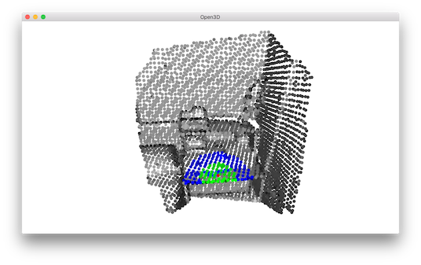

.. _kdtree:

KDTree
-------------------------------------

Open3D uses `FLANN <https://www.cs.ubc.ca/research/flann/>`_ to build KDTrees for fast retrieval of nearest neighbors.

.. literalinclude:: ../../../examples/Python/Basic/kdtree.py
   :language: python
   :lineno-start: 5
   :lines: 5-
   :linenos:

.. _build_kdtree_from_pointcloud:

Build KDTree from point cloud
=====================================

.. literalinclude:: ../../../examples/Python/Basic/kdtree.py
   :language: python
   :lineno-start: 12
   :lines: 12-16
   :linenos:

This script reads a point cloud and builds a KDTree. This is a preprocessing step for the following nearest neighbor queries.

.. _find_neighboring_points:

Find neighboring points
=====================================

.. literalinclude:: ../../../examples/Python/Basic/kdtree.py
   :language: python
   :lineno-start: 19
   :lines: 18-19
   :linenos:

We pick the 1500-th point as the anchor point and paint it red.

Using search_knn_vector_3d
``````````````````````````````````````

.. literalinclude:: ../../../examples/Python/Basic/kdtree.py
   :language: python
   :lineno-start: 22
   :lines: 21-23
   :linenos:

Function ``search_knn_vector_3d`` returns a list of indices of the k nearest neighbors of the anchor point. These neighboring points are painted with blue color. Note that we convert ``pcd.colors`` to a numpy array to make batch access to the point colors, and broadcast a blue color [0, 0, 1] to all the selected points. We skip the first index since it is the anchor point itself.


Using search_radius_vector_3d
``````````````````````````````````````

.. literalinclude:: ../../../examples/Python/Basic/kdtree.py
   :language: python
   :lineno-start: 26
   :lines: 25-27
   :linenos:

Similarly, we can use ``search_radius_vector_3d`` to query all points with distances to the anchor point less than a given radius. We paint these points with green color.

.. literalinclude:: ../../../examples/Python/Basic/kdtree.py
   :language: python
   :lineno-start: 30
   :lines: 29-31
   :linenos:

The visualization looks like:



.. Note:: Besides the KNN search ``search_knn_vector_3d`` and the RNN search ``search_radius_vector_3d``, Open3D provides a hybrid search function ``search_hybrid_vector_3d``. It returns at most k nearest neighbors that have distances to the anchor point less than a given radius. This function combines the criteria of KNN search and RNN search. It is known as RKNN search in some literatures. It has performance benefits in many practical cases, and is heavily used in a number of Open3D functions.
