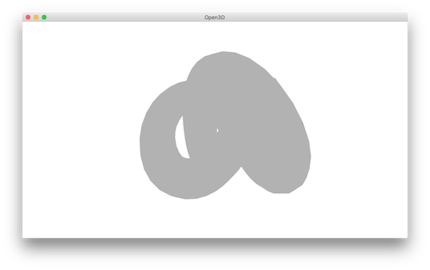
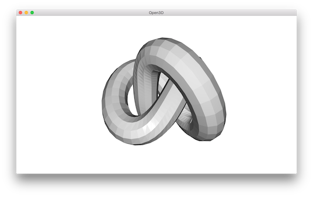
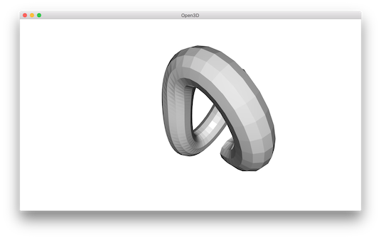
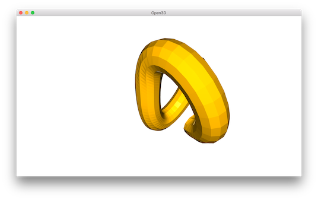

.. _mesh:

Mesh
-------------------------------------

Open3D has a data structure for triangle mesh.

.. literalinclude:: ../../../examples/Python/Basic/mesh.py
   :language: python
   :lineno-start: 5
   :lines: 5-
   :linenos:

.. _print_vertices_and_triangles:

Print vertices and triangles
=====================================

.. literalinclude:: ../../../examples/Python/Basic/mesh.py
   :language: python
   :lineno-start: 13
   :lines: 13-18
   :linenos:

Outputs:

.. code-block:: sh

    TriangleMesh with 1440 points and 2880 triangles.
    [[  4.51268387  28.68865967 -76.55680847]
     [  7.63622284  35.52046967 -69.78063965]
     [  6.21986008  44.22465134 -64.82303619]
     ...,
     [-22.12651634  31.28466606 -87.37570953]
     [-13.91188431  25.4865818  -86.25827026]
     [ -5.27768707  23.36245346 -81.43279266]]
    [[   0   12   13]
     [   0   13    1]
     [   1   13   14]
     ...,
     [1438   11 1439]
     [1439   11    0]
     [1439    0 1428]]

The ``TriangleMesh`` class has a few data fields such as ``vertices`` and ``triangles``. Open3D provides direct memory access to these fields via numpy array.

.. _visualize_3d_mesh:

Visualize 3D mesh
=====================================

.. literalinclude:: ../../../examples/Python/Basic/mesh.py
   :language: python
   :lineno-start: 20
   :lines: 20-24
   :linenos:

The GUI visualizes a mesh.

You can rotate and move the mesh but it is painted with uniform gray color and does not look "3d". The reason is that the current mesh does not have normals for vertices or faces. So uniform color shading is used instead of a more sophisticated Phong shading.

.. _surface_normal_estimation:

Surface normal estimation
=====================================

Let's draw the mesh with surface normal.

.. literalinclude:: ../../../examples/Python/Basic/mesh.py
   :language: python
   :lineno-start: 26
   :lines: 26-29
   :linenos:

It uses ``compute_vertex_normals`` and ``paint_uniform_color`` which are member functions of ``mesh``.
Now it looks like:

Crop mesh
=====================================

We remove half of the surface by directly operate on the ``triangle`` and ``triangle_normals`` data fields of the mesh. This is done via numpy array.

.. literalinclude:: ../../../examples/Python/Basic/mesh.py
   :language: python
   :lineno-start: 31
   :lines: 31-39
   :linenos:

Outputs:

Paint mesh
=====================================

Painting mesh is the same as how it worked for point cloud.

.. literalinclude:: ../../../examples/Python/Basic/mesh.py
   :language: python
   :lineno-start: 41
   :lines: 41-43
   :linenos:

Outputs:

