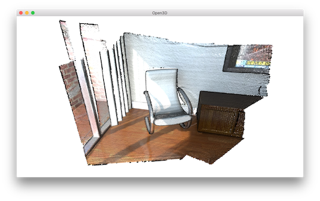
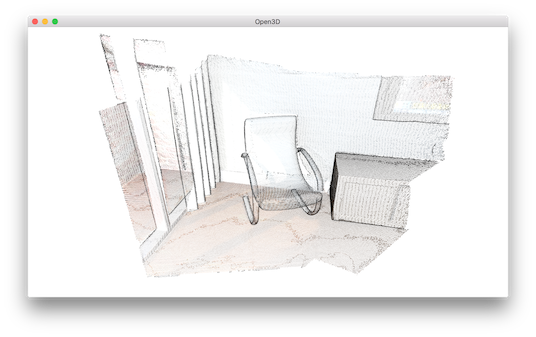
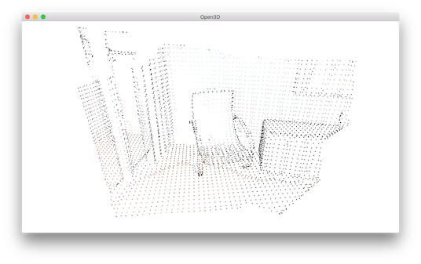
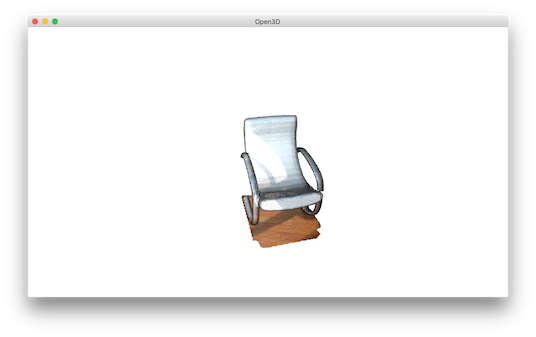
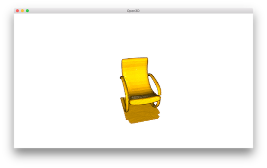

.. _pointcloud:

Point cloud
-------------------------------------

This tutorial demonstrates basic usage of a point cloud.

.. literalinclude:: ../../../examples/Python/Basic/pointcloud.py
   :language: python
   :lineno-start: 5
   :lines: 5-
   :linenos:

.. _visualize_point_cloud:

Visualize point cloud
=====================================

The first part of the tutorial reads a point cloud and visualizes it.

.. literalinclude:: ../../../examples/Python/Basic/pointcloud.py
   :language: python
   :lineno-start: 12
   :lines: 12-16
   :linenos:

``read_point_cloud`` reads a point cloud from a file. It tries to decode the file based on the extension name. The supported extension names are: ``pcd``, ``ply``, ``xyz``, ``xyzrgb``, ``xyzn``, ``pts``.

``draw_geometries`` visualizes the point cloud.
Use mouse/trackpad to see the geometry from different view point.

It looks like a dense surface, but it is actually a point cloud rendered as surfels. The GUI supports various keyboard functions. One of them, the :kbd:`-` key reduces the size of the points (surfels). Press it multiple times, the visualization becomes:

.. note:: Press :kbd:`h` key to print out a complete list of keyboard instructions for the GUI. For more information of the visualization GUI, refer to :ref:`visualization` and :ref:`customized_visualization`.

.. note:: On OS X, the GUI window may not receive keyboard event. In this case, try to launch Python with ``pythonw`` instead of ``python``.

.. _voxel_downsampling:

Voxel downsampling
=====================================

Voxel downsampling uses a regular voxel grid to create a uniformly downsampled point cloud from an input point cloud. It is often used as a pre-processing step for many point cloud processing tasks. The algorithm operates in two steps:

1. Points are bucketed into voxels.
2. Each occupied voxel generates exact one point by averaging all points inside.

.. literalinclude:: ../../../examples/Python/Basic/pointcloud.py
   :language: python
   :lineno-start: 18
   :lines: 18-20
   :linenos:

This is the downsampled point cloud:

.. _vertex_normal_estimation:

Vertex normal estimation
=====================================

Another basic operation for point cloud is point normal estimation.

.. literalinclude:: ../../../examples/Python/Basic/pointcloud.py
   :language: python
   :lineno-start: 22
   :lines: 22-25
   :linenos:

``estimate_normals`` computes normal for every point. The function finds adjacent points and calculate the principal axis of the adjacent points using covariance analysis.

The function takes an instance of ``KDTreeSearchParamHybrid`` class as an argument. The two key arguments ``radius = 0.1`` and ``max_nn = 30`` specifies search radius and maximum nearest neighbor. It has 10cm of search radius, and only considers up to 30 neighbors to save computation time.

.. note:: The covariance analysis algorithm produces two opposite directions as normal candidates. Without knowing the global structure of the geometry, both can be correct. This is known as the normal orientation problem. Open3D tries to orient the normal to align with the original normal if it exists. Otherwise, Open3D does a random guess. Further orientation functions such as ``orient_normals_to_align_with_direction`` and ``orient_normals_towards_camera_location`` need to be called if the orientation is a concern.

Use ``draw_geometries`` to visualize the point cloud and press :kbd:`n` to see point normal. Key :kbd:`-` and key :kbd:`+` can be used to control the length of the normal.

.. image:: ../../_static/Basic/pointcloud/downsampled_normal.png
    :width: 400px

Access estimated vertex normal
=====================================

Estimated normal vectors can be retrieved by ``normals`` variable of ``downpcd``.

.. literalinclude:: ../../../examples/Python/Basic/pointcloud.py
   :language: python
   :lineno-start: 29
   :lines: 27-28
   :linenos:

.. code-block:: sh

    Print a normal vector of 0th point
    [-0.27566603 -0.89197839 -0.35830543]

To check out other variables, please use ``help(downpcd)``.
Normal vectors can be transformed as a numpy array using ``np.asarray``.

.. literalinclude:: ../../../examples/Python/Basic/pointcloud.py
   :language: python
   :lineno-start: 31
   :lines: 29-30
   :linenos:

.. code-block:: sh

    Print the first 100 normal vectors
    [[-0.27566603 -0.89197839 -0.35830543]
     [-0.00694405 -0.99478075 -0.10179902]
     [-0.00399871 -0.99965423 -0.02598917]
     [-0.46344316 -0.68643798 -0.56037785]
     [-0.43476205 -0.62438493 -0.64894177]
     [-0.51440078 -0.56093481 -0.6486478 ]
     [-0.27498453 -0.67317361 -0.68645524]
     [-0.00327304 -0.99977409 -0.02100143]
     [-0.01464332 -0.99960281 -0.02407874]]

Check :ref:`working_with_numpy` for more examples regarding numpy array.

.. _crop_point_cloud:

Crop point cloud
=====================================

.. literalinclude:: ../../../examples/Python/Basic/pointcloud.py
   :language: python
   :lineno-start: 35
   :lines: 33-38
   :linenos:

``read_selection_polygon_volume`` reads a json file that specifies polygon selection area.
``vol.crop_point_cloud(pcd)`` filters out points. Only the chair remains.

.. _paint_point_cloud:

Paint point cloud
=====================================

.. literalinclude:: ../../../examples/Python/Basic/pointcloud.py
   :language: python
   :lineno-start: 42
   :lines: 40-43
   :linenos:

``paint_uniform_color`` paints all the points to a uniform color. The color is in RGB space, [0, 1] range.

