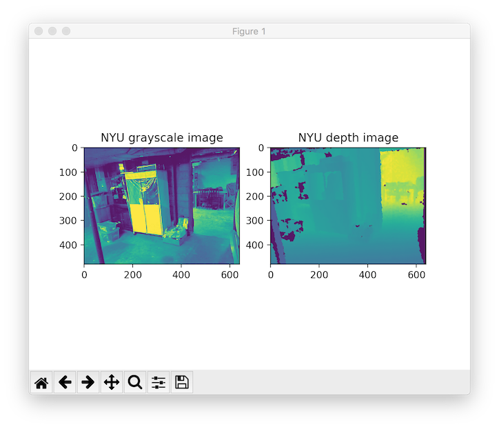
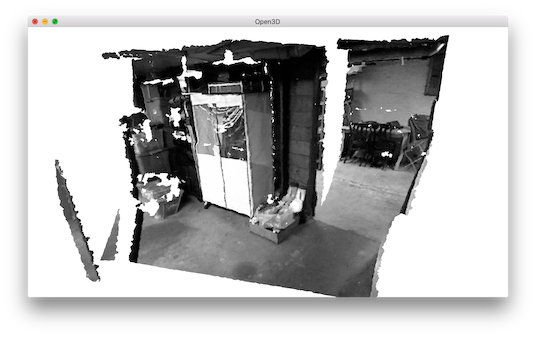

.. _rgbd_nyu:

NYU dataset
-------------------------------------
This tutorial reads and visualizes an ``RGBDImage`` from `the NYU dataset <https://cs.nyu.edu/~silberman/datasets/nyu_depth_v2.html>`_ [Silberman2012]_.

.. literalinclude:: ../../../../examples/Python/Basic/rgbd_nyu.py
   :language: python
   :lineno-start: 5
   :lines: 5-
   :linenos:

This tutorial is almost the same as the tutorial processing :ref:`rgbd_redwood`, with two differences. First, NYU images are not in standard ``jpg`` or ``png`` formats. Thus, we use ``mpimg.imread`` to read the color image as a numpy array and convert it to an Open3D ``Image``. An additional helper function ``read_nyu_pgm`` is called to read depth images from the special big endian ``pgm`` format used in the NYU dataset. Second, we use a different conversion function ``create_rgbd_image_from_nyu_format`` to parse depth images in the SUN dataset.

Similarly, the RGBDImage can be rendered as numpy arrays:

Or a point cloud:

