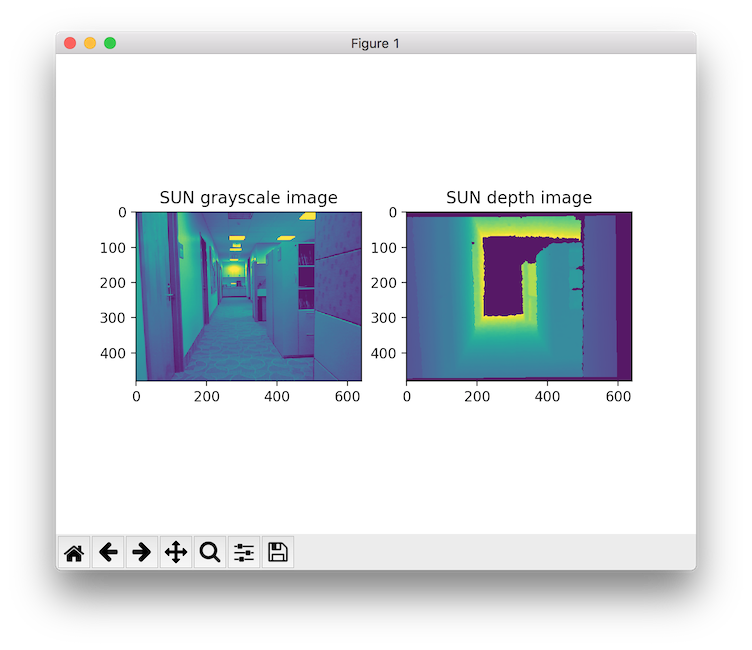
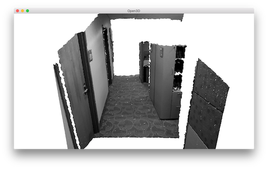

.. _rgbd_sun:

SUN dataset
-------------------------------------
This tutorial reads and visualizes an ``RGBDImage`` of `the SUN dataset <http://rgbd.cs.princeton.edu/>`_ [Song2015]_.

.. literalinclude:: ../../../../examples/Python/Basic/rgbd_sun.py
   :language: python
   :lineno-start: 5
   :lines: 5-
   :linenos:

This tutorial is almost the same as the tutorial processing :ref:`rgbd_redwood`. The only difference is that we use conversion function ``create_rgbd_image_from_sun_format`` to parse depth images in the SUN dataset.

Similarly, the ``RGBDImage`` can be rendered as numpy arrays:

Or a point cloud:

