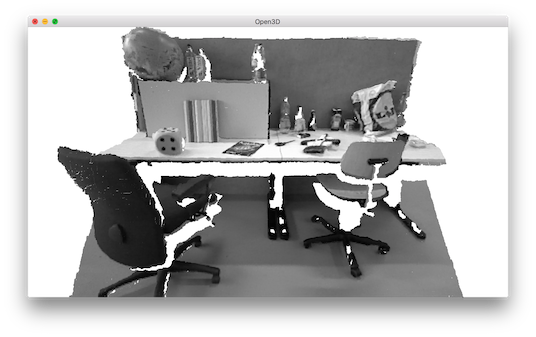

.. _rgbd_tum:

TUM dataset
-------------------------------------
This tutorial reads and visualizes an ``RGBDImage`` from `the TUM dataset <https://vision.in.tum.de/data/datasets/rgbd-dataset>`_ [Strum2012]_.

.. literalinclude:: ../../../../examples/Python/Basic/rgbd_tum.py
   :language: python
   :lineno-start: 5
   :lines: 5-
   :linenos:

This tutorial is almost the same as the tutorial processing :ref:`rgbd_redwood`. The only difference is that we use conversion function ``create_rgbd_image_from_tum_format`` to parse depth images in the TUM dataset.

Similarly, the ``RGBDImage`` can be rendered as numpy arrays:

.. image:: ../../../_static/Basic/rgbd_images/tum_rgbd.png
    :width: 400px

Or a point cloud:

