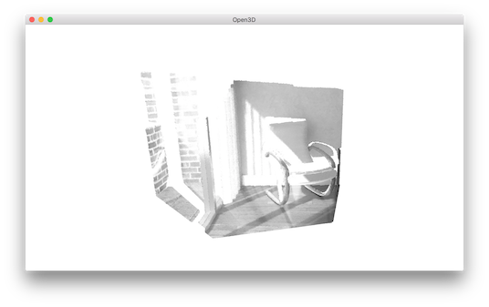

.. _rgbd_odometry:

RGBD odometry
-------------------------------------

An RGBD odometry finds the camera movement between two consecutive RGBD image pairs. The input are two instances of ``RGBDImage``. The output is the motion in the form of a rigid body transformation. Open3D has implemented two RGBD odometries: [Steinbrucker2011]_ and [Park2017]_.

.. code-block:: python

    import sys
    sys.path.append("../..")
    from py3d import *
    import numpy as np

    if __name__ == "__main__":
        pinhole_camera_intrinsic = read_pinhole_camera_intrinsic(
                "../../TestData/camera.json")
        print(pinhole_camera_intrinsic.intrinsic_matrix)

        source_color = read_image("../../TestData/RGBD/color/00000.jpg")
        source_depth = read_image("../../TestData/RGBD/depth/00000.png")
        target_color = read_image("../../TestData/RGBD/color/00001.jpg")
        target_depth = read_image("../../TestData/RGBD/depth/00001.png")
        source_rgbd_image = create_rgbd_image_from_color_and_depth(
                source_color, source_depth);
        target_rgbd_image = create_rgbd_image_from_color_and_depth(
                target_color, target_depth);
        target_pcd = create_point_cloud_from_rgbd_image(
                target_rgbd_image, pinhole_camera_intrinsic)

        option = OdometryOption()
        odo_init = np.identity(4)
        print(option)

        [success_color_term, trans_color_term, info] = compute_rgbd_odometry(
                source_rgbd_image, target_rgbd_image,
                pinhole_camera_intrinsic, odo_init,
                RGBDOdometryJacobianFromColorTerm(), option)
        [success_hybrid_term, trans_hybrid_term, info] = compute_rgbd_odometry(
                source_rgbd_image, target_rgbd_image,
                pinhole_camera_intrinsic, odo_init,
                RGBDOdometryJacobianFromHybridTerm(), option)

        if success_color_term:
            print("Using RGB-D Odometry")
            print(trans_color_term)
            source_pcd_color_term = create_point_cloud_from_rgbd_image(
                    source_rgbd_image, pinhole_camera_intrinsic)
            source_pcd_color_term.transform(trans_color_term)
            draw_geometries([target_pcd, source_pcd_color_term])
        if success_hybrid_term:
            print("Using Hybrid RGB-D Odometry")
            print(trans_hybrid_term)
            source_pcd_hybrid_term = create_point_cloud_from_rgbd_image(
                    source_rgbd_image, pinhole_camera_intrinsic)
            source_pcd_hybrid_term.transform(trans_hybrid_term)
            draw_geometries([target_pcd, source_pcd_hybrid_term])

.. _reading_camera_intrinsic:

Read camera intrinsic
=====================================

We first read the camera intrinsic matrix from a json file.

.. code-block:: python

    pinhole_camera_intrinsic = read_pinhole_camera_intrinsic(
            "../../TestData/camera.json")
    print(pinhole_camera_intrinsic.intrinsic_matrix)

This yields:

.. code-block:: sh

    [[ 415.69219382    0.          319.5       ]
     [   0.          415.69219382  239.5       ]
     [   0.            0.            1.        ]]

.. Note:: Lots of small data structures in Open3D can be read from / written into ``json`` files. This includes camera intrinsics, camera trajectory, pose graph, etc.

.. _reading_rgbd_image:

Read RGBD image
=====================================

.. code-block:: python

    source_color = read_image("../../TestData/RGBD/color/00000.jpg")
    source_depth = read_image("../../TestData/RGBD/depth/00000.png")
    target_color = read_image("../../TestData/RGBD/color/00001.jpg")
    target_depth = read_image("../../TestData/RGBD/depth/00001.png")
    source_rgbd_image = create_rgbd_image_from_color_and_depth(
            source_color, source_depth)
    target_rgbd_image = create_rgbd_image_from_color_and_depth(
            target_color, target_depth)

This code block reads two pairs of RGBD images in the Redwood format. We refer to :ref:`rgbd_redwood` for a comprehensive explanation.

.. note:: Open3D assumes the color image and depth image are synchronized and registered in the same coordinate frame. This can usually be done by turning on both the synchronization and registration features in the RGBD camera settings.

.. _compute_odometry:

Compute odometry from two RGBD image pairs
==================================================

.. code-block:: python

    [success, trans_color_term, info] = compute_rgbd_odometry(
            source_rgbd_image, target_rgbd_image,
            pinhole_camera_intrinsic, odo_init,
            RGBDOdometryJacobianFromColorTerm(), option)
    [success, trans_hybrid_term, info] = compute_rgbd_odometry(
            source_rgbd_image, target_rgbd_image,
            pinhole_camera_intrinsic, odo_init,
            RGBDOdometryJacobianFromHybridTerm(), option)

This code block calls two different RGBD odometry methods. The first one is [Steinbrucker2011]_. It minimizes photo consistency of aligned images. The second one is [Park2017]_. In addition to photo consistency, it implements constraint for geometry. Both functions run in similar speed. But [Park2017]_ is more accurate in our test on benchmark datasets. It is recommended.

.. _visualize_rgbd_image:

Visualize RGBD image pairs
=====================================

.. code-block:: python

    if success_color_term:
        print("Using RGB-D Odometry")
        print(trans_color_term)
        source_pcd_color_term = create_point_cloud_from_rgbd_image(
                source_rgbd_image, pinhole_camera_intrinsic)
        source_pcd_color_term.transform(trans_color_term)
        draw_geometries([target_pcd, source_pcd_color_term])
    if success_hybrid_term:
        print("Using Hybrid RGB-D Odometry")
        print(trans_hybrid_term)
        source_pcd_hybrid_term = create_point_cloud_from_rgbd_image(
                source_rgbd_image, pinhole_camera_intrinsic)
        source_pcd_hybrid_term.transform(trans_hybrid_term)
        draw_geometries([target_pcd, source_pcd_hybrid_term])

The RGBD image pairs are converted into point clouds and rendered together. Note that the point cloud representing the first (source) RGBD image is transformed with the transformation estimated by the odometry. After this transformation, both point clouds are aligned.

Outputs:

.. code-block:: sh

    Using RGB-D Odometry
    [[  9.99985131e-01  -2.26255547e-04  -5.44848980e-03  -4.68289761e-04]
     [  1.48026964e-04   9.99896965e-01  -1.43539723e-02   2.88993731e-02]
     [  5.45117608e-03   1.43529524e-02   9.99882132e-01   7.82593526e-04]
     [  0.00000000e+00   0.00000000e+00   0.00000000e+00   1.00000000e+00]]

.. code-block:: sh

    Using Hybrid RGB-D Odometry
    [[  9.99994666e-01  -1.00290715e-03  -3.10826763e-03  -3.75410348e-03]
     [  9.64492959e-04   9.99923448e-01  -1.23356675e-02   2.54977516e-02]
     [  3.12040122e-03   1.23326038e-02   9.99919082e-01   1.88139799e-03]
     [  0.00000000e+00   0.00000000e+00   0.00000000e+00   1.00000000e+00]]

