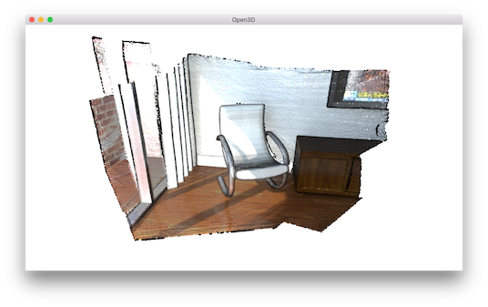
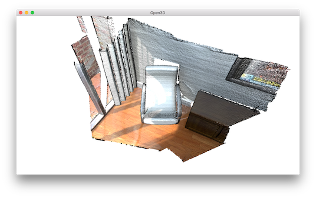
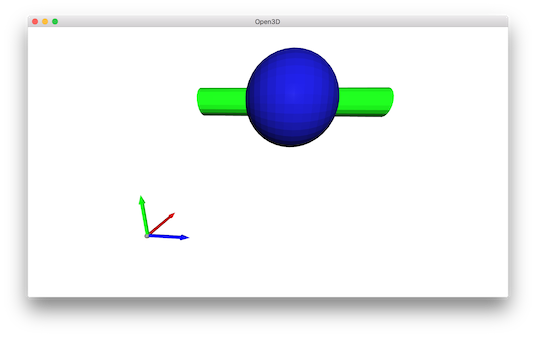

.. _visualization:

Visualization
-------------------------------------

.. literalinclude:: ../../../examples/Python/Basic/visualization.py
   :language: python
   :lineno-start: 5
   :lines: 5-
   :linenos:

.. _function_draw_geometries:

Function draw_geometries
=====================================

.. literalinclude:: ../../../examples/Python/Basic/visualization.py
   :language: python
   :lineno-start: 12
   :lines: 12-14
   :linenos:

Open3D provides a convenient visualization function ``draw_geometries`` which takes a list of geometry objects (``PointCloud``, ``TriangleMesh``, or ``Image``), and renders them together. We have implemented many functions in the visualizer, such as rotation, translation, and scaling via mouse operations, changing rendering style, and screen capture. Press :kbd:`h` inside the window to print out a comprehensive list of functions.

.. code-block:: sh

    -- Mouse view control --
      Left button + drag         : Rotate.
      Ctrl + left button + drag  : Translate.
      Wheel button + drag        : Translate.
      Shift + left button + drag : Roll.
      Wheel                      : Zoom in/out.

    -- Keyboard view control --
      [/]          : Increase/decrease field of view.
      R            : Reset view point.
      Ctrl/Cmd + C : Copy current view status into the clipboard.
      Ctrl/Cmd + V : Paste view status from clipboard.

    -- General control --
      Q, Esc       : Exit window.
      H            : Print help message.
      P, PrtScn    : Take a screen capture.
      D            : Take a depth capture.
      O            : Take a capture of current rendering settings.
    :

.. Note:: In some operating systems (e.g., OS X), the visualization window may not respond to keyboard input. This is usually because the console retains the input focus instead of passing it to the visualization window. Calling ``pythonw visualization.py`` instead of ``python visualization.py`` will resolve this issue.

.. Note:: In addition to ``draw_geometries``, Open3D has a set of sibling functions with more advanced functionality. ``draw_geometries_with_custom_animation`` allows the programmer to define a custom view trajectory and play an animation in the GUI. ``draw_geometries_with_animation_callback`` and ``draw_geometries_with_key_callback`` accept Python callback functions as input. The callback function is called in an automatic animation loop, or upon a key press event. See :ref:`customized_visualization` for details.

.. _store_view_point:

Store view point
=====================================

In the beginning, the point cloud is rendered upside down.

.. image:: ../../_static/Basic/visualization/badview.png
    :width: 400px

After adjusting view points using mouse left button + drag, we can reach a better view point.

To retain this view point, press :kbd:`ctrl+c`. The view point will be translated into a json string stored in clipboard. When you move the camera to a different view, such as:

You can get back to the original view by pressing :kbd:`ctrl+v`.

.. _rendering_style:

Rendering styles
=====================================

Open3D ``Visualizer`` supports several rendering styles. For example, pressing :kbd:`l` will switch between a Phong lighting and a simple color rendering. Pressing :kbd:`2` shows points colored based on x-coordinate.

.. image:: ../../_static/Basic/visualization/colormap_jet.png
    :width: 400px

The color map can also be adjusted by, for example, pressing :kbd:`shift+4`. This changes jet color map to hot color map.

.. image:: ../../_static/Basic/visualization/colormap_hot.png
    :width: 400px

.. _geometry_primitives:

Geometry primitives
=====================================

.. literalinclude:: ../../../examples/Python/Basic/visualization.py
   :language: python
   :lineno-start: 16
   :lines: 16-30
   :linenos:

This script generates a cube, a sphere, and a cylinder using ``create_mesh_cubic``, ``create_mesh_sphere`` and
``create_mesh_cylinder``.  The cube is painted in red, sphere is painted in blue, and the cylinder is painted in green. Normals are computed for both meshes to support the Phong shading (see :ref:`visualize_3d_mesh` and :ref:`surface_normal_estimation`). We can even create a coordinate axis using ``create_mesh_coordinate_frame``, with its origin point set at (-2, -2, -2).

.. _draw_multiple_geometries:

Draw multiple geometries
=====================================

.. literalinclude:: ../../../examples/Python/Basic/visualization.py
   :language: python
   :lineno-start: 32
   :lines: 32-38
   :linenos:

``draw_geometries`` takes a list of geometries and renders them all together. Alternatively, ``TriangleMesh`` supports a ``+`` operator to combine multiple meshes into one. We recommend the first approach since it supports a combination of different geometries (e.g., a mesh can be rendered in tandem with a point cloud).

.. _draw_line_set:

Draw line set
=====================================

.. literalinclude:: ../../../examples/Python/Basic/visualization.py
   :language: python
   :lineno-start: 40
   :lines: 40-71
   :linenos:

To draw lines, it is necessary to define ``LineSet`` and create a set of points and a set of edges. An edge is a pair of point indices. The above example creates custom ``points`` and edges (denoted as ``lines``) to make a cube. Color is optional - red color ``[1,0,0]`` is assigned to each edge in this example. This script visualizes the following cube.

.. image:: ../../_static/Basic/visualization/lineset.png
    :width: 400px
