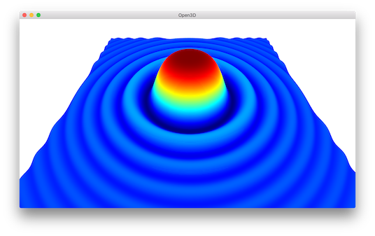
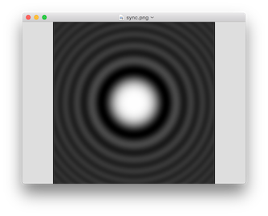

.. _working_with_numpy:

Working with NumPy
-------------------------------------

Data structure of Open3D is natively compatible with `NumPy <http://www.numpy.org/>`_ buffer.
The following tutorial generates a variant of sync function using NumPy and visualizes the function using Open3D.

.. literalinclude:: ../../../examples/Python/Basic/working_with_numpy.py
   :language: python
   :lineno-start: 5
   :lines: 5-
   :linenos:

The first part of the script generates a :math:`n \times 3` matrix ``xyz``.
Each column has :math:`x, y, z` value of a function :math:`z = \frac{sin (x^2+y^2)}{(x^2+y^2)}`.
:math:`z_{norm}` is normalized map of :math:`z` for [0,1] range.

.. _from_numpy_to_open3d_pointcloud:

From NumPy to open3d.PointCloud
===============================

.. literalinclude:: ../../../examples/Python/Basic/working_with_numpy.py
   :language: python
   :lineno-start: 25
   :lines: 25-28
   :linenos:

Open3D provides conversion from NumPy matrix to a vector of 3D vectors. By using ``Vector3dVector``, NumPy matrix can be directly assigned for ``open3d.PointCloud.points``.

In this manner, any similar data structure such as ``open3d.PointCloud.colors`` or ``open3d.PointCloud.normals`` can be assigned or modified using NumPy. The script saves the point cloud as a ply file for the next step.

.. _from_open3d_pointcloud_to_numpy:

From open3d.PointCloud to NumPy
===============================

.. literalinclude:: ../../../examples/Python/Basic/working_with_numpy.py
   :language: python
   :lineno-start: 30
   :lines: 30-37
   :linenos:

As shown in this example, ``Vector3dVector`` is converted into a NumPy array using ``np.asarray``.

The tutorial script prints two identical matrices

.. code-block:: sh

    xyz
    [[-3.00000000e+00 -3.00000000e+00 -3.89817183e-17]
     [-2.98500000e+00 -3.00000000e+00 -4.94631078e-03]
     [-2.97000000e+00 -3.00000000e+00 -9.52804798e-03]
     ...
     [ 2.97000000e+00  3.00000000e+00 -9.52804798e-03]
     [ 2.98500000e+00  3.00000000e+00 -4.94631078e-03]
     [ 3.00000000e+00  3.00000000e+00 -3.89817183e-17]]
    Writing PLY: [========================================] 100%
    Reading PLY: [========================================] 100%
    xyz_load
    [[-3.00000000e+00 -3.00000000e+00 -3.89817183e-17]
     [-2.98500000e+00 -3.00000000e+00 -4.94631078e-03]
     [-2.97000000e+00 -3.00000000e+00 -9.52804798e-03]
     ...
     [ 2.97000000e+00  3.00000000e+00 -9.52804798e-03]
     [ 2.98500000e+00  3.00000000e+00 -4.94631078e-03]
     [ 3.00000000e+00  3.00000000e+00 -3.89817183e-17]]

and visualizes the function:

.. _from_numpy_to_open3d_image:

From NumPy to open3d.Image
==========================

2D Numpy matrix can be converted image. The following example converts ``z_norm`` into open3d.Image,
visualize the image using ``draw_geometries``, and save the image as a png format file.

.. literalinclude:: ../../../examples/Python/Basic/working_with_numpy.py
   :language: python
   :lineno-start: 39
   :lines: 39-42
   :linenos:

.. Note:: The conversion supports ``uint8``, ``uint16``, or ``float32`` with c_type storage (default NumPy behavior),
          dim=2`` (width * height) or dim=3 (width * height * channel).
