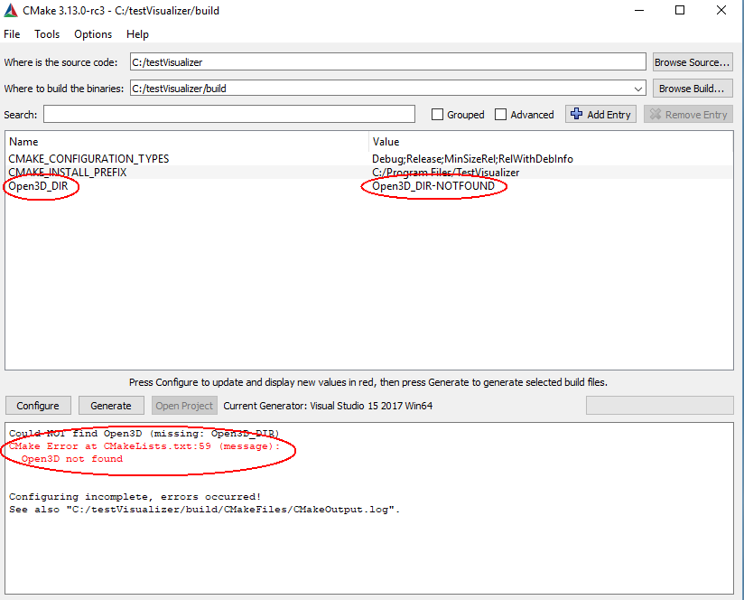
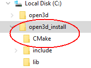
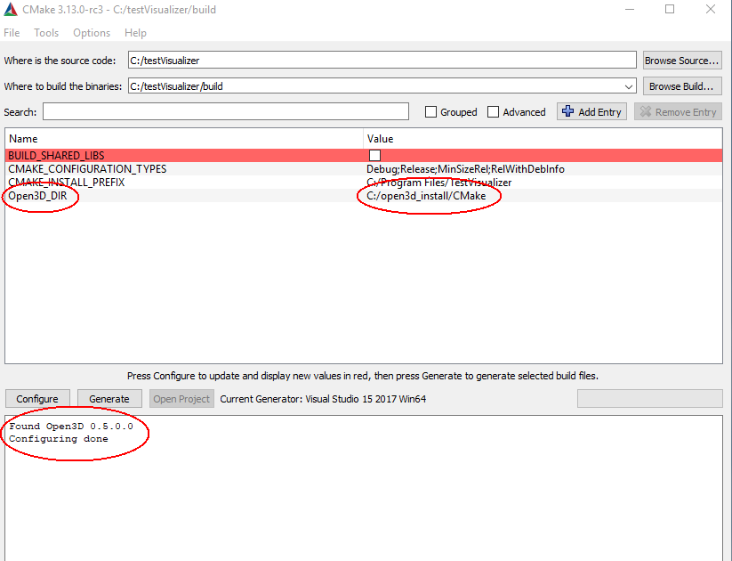

.. _cplusplus_interface_tutorial:

C++ interface
-------------

This page explains how to create a CMake based C++ project using the Open3D C++ interface.

.. note:: For help on the C++ interfaces, refer to examples in [examples/Cpp/Test], [examples/Cpp/Experimental] and [src/Tools] folder and check `Doxygen document for C++ API <../../cpp_api/index.html>`_.

.. _install_open3d_from_source:

Install open3d from source
==========================

For installing from source see :ref:`compilation`.

.. _create_cplusplus_project:

Create C++ project
==================

Ubuntu/MacOs
````````````

Let's create a basic C++ project based on CMake and Open3D installed libraries and headers.

1. Get the code from :download:`TestVisualizer.cpp <../../_static/C++/TestVisualizer.cpp>`
2. Get the CMake config file from :download:`CMakeLists.txt <../../_static/C++/CMakeLists.txt>`
3. Build the project using the following commands:

.. code-block:: bash

    mkdir -p build
    cd build
    cmake -DCMAKE_PREFIX_PATH="<Open3D_install_path>/lib/cmake/" ..
    make -j

The ``CMAKE_PREFIX_PATH`` option is used to tell the CMake where to look for the Open3D installed files.
For example, if Open3D was installed to ``~/open3d_install``, the cmake command would look like this:

.. code-block:: bash

    cmake -DCMAKE_PREFIX_PATH="~/open3d_install/lib/cmake/" ..

Windows
```````

The steps for creating a C++ project based on the Open3D installed libraries and headers on Windows is very similar.

1. Copy the ``TestVisualizer.cpp`` and ``CMakeLists.txt`` files to ``C:/testVisualizer``.
2. Open CMake GUI and set the source folder to ``C:/testVisualizer`` and the binaries folder to ``C:/testVisualizer/build``.
3. Configure.

At this time you will see that CMake is unable to find Open3D.



For simplicity the Open3D install location is ``C:/open3d_install``.



In order for CMake to find the Open3D installed files you need to set ``Open3D_DIR`` to the location of the Open3D installed CMake files which is ``C:/open3d_install/CMake``.

4. Configure. CMake finds Open3D.



5. Generate. Open the TestVisualizer project and build.

Alternatively, this can be done by calling CMake from the console:

.. code-block:: bat

    cd Open3D
    mkdir build
    cd build
    cmake -G "Visual Studio 15 2017 Win64" -DCMAKE_INSTALL_PREFIX=C:\open3d_install ..
    cmake --build . --parallel %NUMBER_OF_PROCESSORS% --config Release --target install

    cd ..\docs\_static\C++\
    mkdir build
    cd build
    cmake -G "Visual Studio 15 2017 Win64" -DCMAKE_PREFIX_PATH=C:\open3d_install ..
    cmake --build . --parallel %NUMBER_OF_PROCESSORS% --config Release
    Release\TestVisualizer.exe

Highlights
``````````

The following fragment from ``CMakeLists.txt`` shows how to specify hints to CMake when looking for the Open3D installation.
This technique is required when installing Open3D to a user location rather than to a system wide location.

.. literalinclude:: ../../_static/C++/CMakeLists.txt
   :language: cmake
   :lineno-start: 13
   :lines: 13-18
   :linenos:

This section of the ``CMakeLists.txt`` specifies the installed Open3D include directories, libraries and library directories.

.. literalinclude:: ../../_static/C++/CMakeLists.txt
   :language: cmake
   :lineno-start: 40
   :lines: 40-46
   :linenos:
