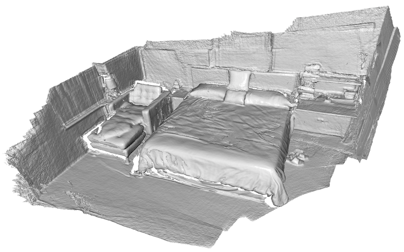

.. _reconstruction_system_integrate_scene:

Integrate scene
-------------------------------------

After optmizing posegraph and camera poses, the final step is to integrate all the RGBD frames into a single TSDF volume. The mesh extracted from this volume is the 3D scene.

This tutorial reviews `src/Python/Tutorial/ReconstructionSystem/integrate_scene.py <../../../../../src/Python/Tutorial/ReconstructionSystem/integrate_scene.py>`_ function by function. The tutorial script makes fragments from RGBD image sequence.


Input arguments
``````````````````````````````````````

.. code-block:: python

    if __name__ == "__main__":
        parser = argparse.ArgumentParser(description=
                "integrate the whole RGBD sequence using estimated camera pose")
        parser.add_argument("path_dataset", help="path to the dataset")
        parser.add_argument("-path_intrinsic",
                help="path to the RGBD camera intrinsic")
        args = parser.parse_args()

        if args.path_intrinsic:
            intrinsic = read_pinhole_camera_intrinsic(args.path_intrinsic)
        else:
            intrinsic = PinholeCameraIntrinsic.prime_sense_default
        scalable_integrate_rgb_frames(args.path_dataset, intrinsic)

The script runs with ``python integrate_scene.py [path]``. [path] should have subfolders *image* and *depth* in which frames are synchronized and aligned. The optional argument ``-path_intrinsic`` specifies path to json file that has a camera intrinsic matrix. An example about reading RGBD camera intrinsic is found from :ref:`reading_camera_intrinsic`.


Integrate RGBD frames
``````````````````````````````````````

The core function of this script is shown below:

.. code-block:: python

    def scalable_integrate_rgb_frames(path_dataset, intrinsic):
        [color_files, depth_files] = get_rgbd_file_lists(path_dataset)
        n_files = len(color_files)
        n_frames_per_fragment = 100
        n_fragments = int(math.ceil(float(n_files) / n_frames_per_fragment))
        volume = ScalableTSDFVolume(voxel_length = 3.0 / 512.0,
                sdf_trunc = 0.04, with_color = True)

        pose_graph_fragment = read_pose_graph(
                path_dataset + template_global_posegraph_optimized)

        for fragment_id in range(len(pose_graph_fragment.nodes)):
            pose_graph_rgbd = read_pose_graph(path_dataset +
                    template_fragment_posegraph_optimized % fragment_id)

            for frame_id in range(len(pose_graph_rgbd.nodes)):
                frame_id_abs = fragment_id * n_frames_per_fragment + frame_id
                print("Fragment %03d / %03d :: integrate rgbd frame %d (%d of %d)."
                        % (fragment_id, n_fragments-1, frame_id_abs, frame_id+1,
                        len(pose_graph_rgbd.nodes)))
                color = read_image(color_files[frame_id_abs])
                depth = read_image(depth_files[frame_id_abs])
                rgbd = create_rgbd_image_from_color_and_depth(color, depth,
                        depth_trunc = 3.0, convert_rgb_to_intensity = False)
                pose = np.dot(pose_graph_fragment.nodes[fragment_id].pose,
                        pose_graph_rgbd.nodes[frame_id].pose)
                volume.integrate(rgbd, intrinsic, np.linalg.inv(pose))

        mesh = volume.extract_triangle_mesh()
        mesh.compute_vertex_normals()
        draw_geometries([mesh])

        mesh_name = path_dataset + template_global_mesh
        write_triangle_mesh(mesh_name, mesh, False, True)

Function ``scalable_integrate_rgb_frames`` defines ``ScalableTSDFVolume``. Note that ``ScalableTSDFVolume`` is not limited to 3x3x3 cubic space as it has *scalable* hashing scheme.

The script reads two posegraphs ``pose_graph_fragment`` and ``pose_graph_rgbd``. ``pose_graph_fragment`` has optmized poses of the fragments, and ``pose_graph_rgbd`` has optimized camera trajectory within a fragment.

``pose = np.dot(pose_graph_fragment.nodes[fragment_id].pose, pose_graph_rgbd.nodes[frame_id].pose)`` computes world-coordinate camera pose for RGBD frame belongs to ``fragment_id`` and ``frame_id``. This pose is used for integrating color and depth frames into TSDF volume using ``volume.integrate(rgbd, intrinsic, np.linalg.inv(pose))``

The mesh is extracted from volume using ``mesh = volume.extract_triangle_mesh()`` and it is written as scene.ply using ``write_triangle_mesh(mesh_name, mesh, False, True)``.


Results
``````````````````````````````````````
This is a printed log from the script.

.. code-block:: shell

    Fragment 000 / 013 :: integrate rgbd frame 0 (1 of 100).
    Fragment 000 / 013 :: integrate rgbd frame 1 (2 of 100).
    Fragment 000 / 013 :: integrate rgbd frame 2 (3 of 100).
    Fragment 000 / 013 :: integrate rgbd frame 3 (4 of 100).
    :
    Fragment 013 / 013 :: integrate rgbd frame 1360 (61 of 64).
    Fragment 013 / 013 :: integrate rgbd frame 1361 (62 of 64).
    Fragment 013 / 013 :: integrate rgbd frame 1362 (63 of 64).
    Fragment 013 / 013 :: integrate rgbd frame 1363 (64 of 64).
    Writing PLY: [========================================] 100%

The following images show final scene reconstruction.


