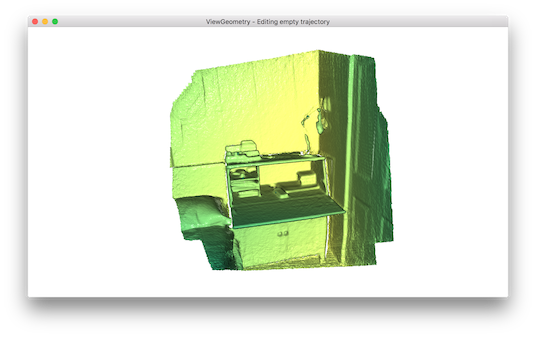
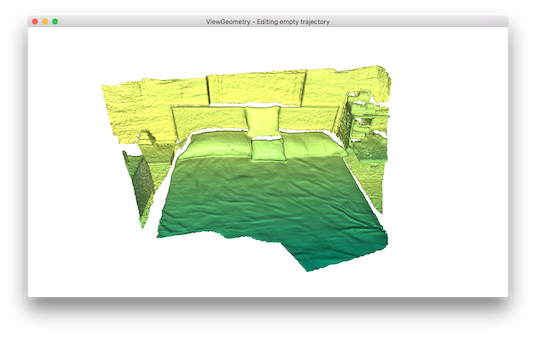
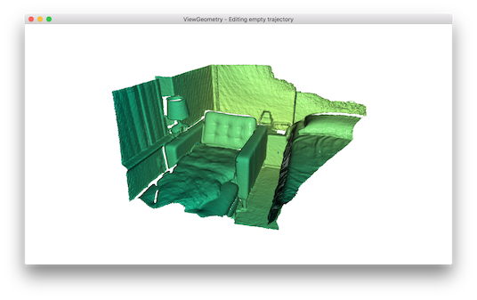
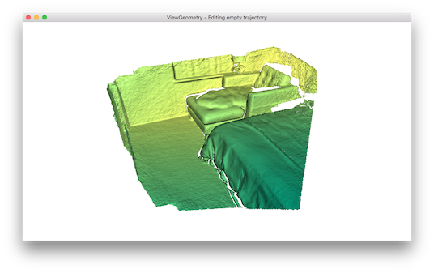

.. _reconstruction_system_make_fragments:

Make fragments
-------------------------------------

The first step of the scene reconstruction system is to create fragments from short RGBD sequences.

Input arguments
``````````````````````````````````````

The script runs with ``python run_system.py [config] --make``. In ``[config]``, ``["path_dataset"]`` should have subfolders ``image`` and ``depth`` to store the color images and depth images respectively. We assume the color images and the depth images are synchronized and registered. In ``[config]``, the optional argument ``["path_intrinsic"]`` specifies the path to a json file that stores the camera intrinsic matrix (See :ref:`/tutorial/Basic/rgbd_odometry.ipynb#read-camera-intrinsic` for details). If it is not given, the PrimeSense factory setting is used instead.

.. _make_fragments_register_rgbd_image_pairs:

Register RGBD image pairs
``````````````````````````````````````

.. literalinclude:: ../../../examples/Python/ReconstructionSystem/make_fragments.py
   :language: python
   :lineno-start: 33
   :lines: 5,34-59
   :linenos:

The function reads a pair of RGBD images and registers the ``source_rgbd_image`` to the ``target_rgbd_image``. Open3D function ``compute_rgbd_odometry`` is called to align the RGBD images. For adjacent RGBD images, an identity matrix is used as initialization. For non-adjacent RGBD images, wide baseline matching is used as an initialization. In particular, function ``pose_estimation`` computes OpenCV ORB feature to match sparse features over wide baseline images, then performs 5-point RANSAC to estimate a rough alignment, which is used as the initialization of ``compute_rgbd_odometry``.


.. _make_fragments_make_a_posegraph:

Multiway registration
``````````````````````````````````````

.. literalinclude:: ../../../examples/Python/ReconstructionSystem/make_fragments.py
   :language: python
   :lineno-start: 61
   :lines: 5,62-108
   :linenos:

This script uses the technique demonstrated in :ref:`/tutorial/Advanced/multiway_registration.ipynb`. Function ``make_posegraph_for_fragment`` builds a pose graph for multiway registration of all RGBD images in this sequence. Each graph node represents an RGBD image and its pose which transforms the geometry to the global fragment space. For efficiency, only key frames are used.

Once a pose graph is created, multiway registration is performed by calling function ``optimize_posegraph_for_fragment``.

.. literalinclude:: ../../../examples/Python/ReconstructionSystem/optimize_posegraph.py
   :language: python
   :lineno-start: 12
   :lines: 5,13-40
   :linenos:

This function calls ``global_optimization`` to estimate poses of the RGBD images.

.. _make_fragments_make_a_fragment:

Make a fragment
``````````````````````````````````````

.. literalinclude:: ../../../examples/Python/ReconstructionSystem/make_fragments.py
   :language: python
   :lineno-start: 110
   :lines: 5,111-145
   :linenos:

Once the poses are estimates, :ref:`/tutorial/Advanced/rgbd_integration.ipynb` is used to reconstruct a colored fragment from each RGBD sequence.

Batch processing
``````````````````````````````````````

.. literalinclude:: ../../../examples/Python/ReconstructionSystem/make_fragments.py
   :language: python
   :lineno-start: 167
   :lines: 5,168-187
   :linenos:

The main function calls each individual function explained above.

.. _reconstruction_system_make_fragments_results:

Results
``````````````````````````````````````

.. code-block:: sh

    Fragment 000 / 013 :: RGBD matching between frame : 0 and 1
    Fragment 000 / 013 :: RGBD matching between frame : 0 and 5
    Fragment 000 / 013 :: RGBD matching between frame : 0 and 10
    Fragment 000 / 013 :: RGBD matching between frame : 0 and 15
    Fragment 000 / 013 :: RGBD matching between frame : 0 and 20
    :
    Fragment 000 / 013 :: RGBD matching between frame : 95 and 96
    Fragment 000 / 013 :: RGBD matching between frame : 96 and 97
    Fragment 000 / 013 :: RGBD matching between frame : 97 and 98
    Fragment 000 / 013 :: RGBD matching between frame : 98 and 99

The following is a log from ``optimize_posegraph_for_fragment``.

.. code-block:: sh

    [GlobalOptimizationLM] Optimizing PoseGraph having 100 nodes and 195 edges.
    Line process weight : 389.309502
    [Initial     ] residual : 3.223357e+05, lambda : 1.771814e+02
    [Iteration 00] residual : 1.721845e+04, valid edges : 157, time : 0.022 sec.
    [Iteration 01] residual : 1.350251e+04, valid edges : 168, time : 0.017 sec.
    :
    [Iteration 32] residual : 9.779118e+03, valid edges : 179, time : 0.013 sec.
    Current_residual - new_residual < 1.000000e-06 * current_residual
    [GlobalOptimizationLM] total time : 0.519 sec.
    [GlobalOptimizationLM] Optimizing PoseGraph having 100 nodes and 179 edges.
    Line process weight : 398.292104
    [Initial     ] residual : 5.120047e+03, lambda : 2.565362e+02
    [Iteration 00] residual : 5.064539e+03, valid edges : 179, time : 0.014 sec.
    [Iteration 01] residual : 5.037665e+03, valid edges : 178, time : 0.015 sec.
    :
    [Iteration 11] residual : 5.017307e+03, valid edges : 177, time : 0.013 sec.
    Current_residual - new_residual < 1.000000e-06 * current_residual
    [GlobalOptimizationLM] total time : 0.197 sec.
    CompensateReferencePoseGraphNode : reference : 0

The following is a log from ``integrate_rgb_frames_for_fragment``.

.. code-block:: sh

    Fragment 000 / 013 :: integrate rgbd frame 0 (1 of 100).
    Fragment 000 / 013 :: integrate rgbd frame 1 (2 of 100).
    Fragment 000 / 013 :: integrate rgbd frame 2 (3 of 100).
    :
    Fragment 000 / 013 :: integrate rgbd frame 97 (98 of 100).
    Fragment 000 / 013 :: integrate rgbd frame 98 (99 of 100).
    Fragment 000 / 013 :: integrate rgbd frame 99 (100 of 100).

The following images show some of the fragments made by this script.








