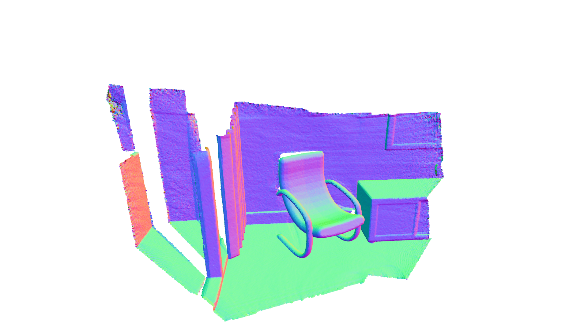
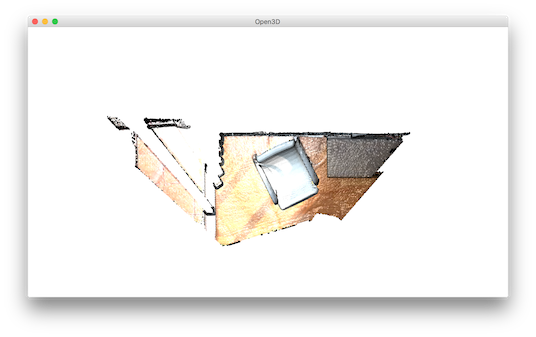
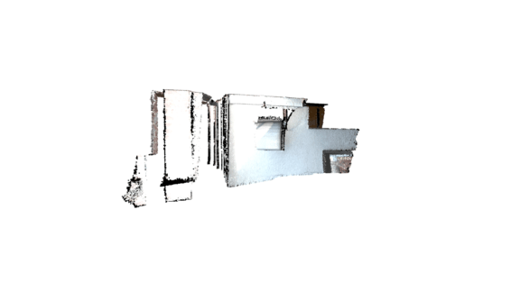
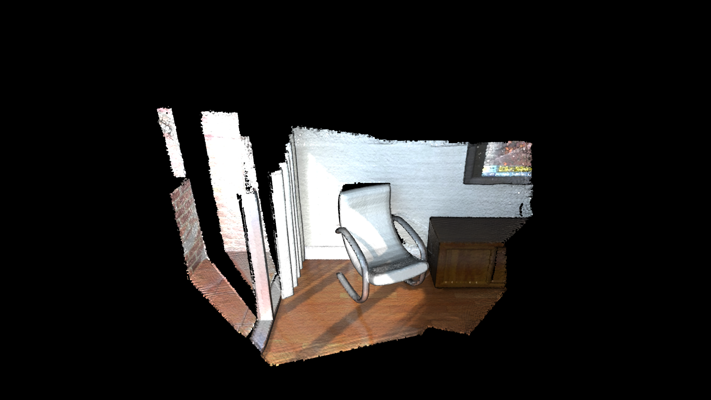
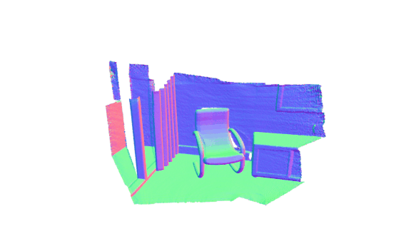
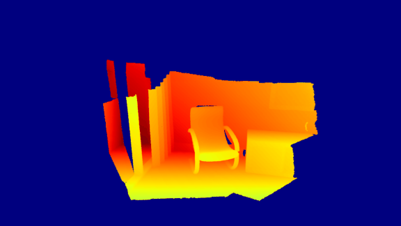

.. _customized_visualization:

Customized visualization
-------------------------------------

The usage of Open3D convenient visualization functions ``draw_geometries`` and ``draw_geometries_with_custom_animation`` is straightforward. Everything can be done with the GUI. Press :kbd:`h` inside the visualizer window to see helper information. For more details, see :any:`/tutorial/visualization/visualization.ipynb`.

This tutorial focuses on more advanced functionalities to customize the behavior of the visualizer window. Please refer to examples/python/visualization/customized_visualization.py to try the following examples.


Mimic draw_geometries() with Visualizer class
````````````````````````````````````````````````````

.. literalinclude:: ../../../examples/python/visualization/customized_visualization.py
   :language: python
   :lineno-start: 13
   :lines: 13-20
   :linenos:

This function produces exactly the same functionality as the convenience function ``draw_geometries``.

.. image:: ../../_static/visualization/customized_visualization/custom.png
    :width: 400px

Class ``Visualizer`` has a couple of variables such as a ``ViewControl`` and a ``RenderOption``. The following function reads a predefined ``RenderOption`` stored in a json file.

.. literalinclude:: ../../../examples/python/visualization/customized_visualization.py
   :language: python
   :lineno-start: 46
   :lines: 46-52
   :linenos:

Outputs:




Change field of view
````````````````````````````````````
To change field of view of the camera, it is first necessary to get an instance of the visualizer control. To modify the field of view, use ``change_field_of_view``.

.. literalinclude:: ../../../examples/python/visualization/customized_visualization.py
   :language: python
   :lineno-start: 23
   :lines: 23-32
   :linenos:

The field of view (FoV) can be set to a degree in the range [5,90]. Note that ``change_field_of_view`` adds the specified FoV to the current FoV. By default, the visualizer has an FoV of 60 degrees. Calling the following code

.. code-block:: python

    custom_draw_geometry_with_custom_fov(pcd, 90.0)

will add the specified 90 degrees to the default 60 degrees. As it exceeds the maximum allowable FoV, the FoV is set to 90 degrees.

.. image:: ../../_static/visualization/customized_visualization/fov_90.png
    :width: 400px

The following code

.. code-block:: python

    custom_draw_geometry_with_custom_fov(pcd, -90.0)

will set FoV to 5 degrees, because 60 - 90 = -30 is less than 5 degrees.




Callback functions
````````````````````````````````````

.. literalinclude:: ../../../examples/python/visualization/customized_visualization.py
   :language: python
   :lineno-start: 35
   :lines: 35-43
   :linenos:

Function ``draw_geometries_with_animation_callback`` registers a Python callback function ``rotate_view`` as the idle function of the main loop. It rotates the view along the x-axis whenever the visualizer is idle. This defines an animation behavior.



.. literalinclude:: ../../../examples/python/visualization/customized_visualization.py
   :language: python
   :lineno-start: 55
   :lines: 55-84
   :linenos:

Callback functions can also be registered upon key press event. This script registered four keys. For example, pressing :kbd:`k` changes the background color to black.



Capture images in a customized animation
`````````````````````````````````````````````````

.. literalinclude:: ../../../examples/python/visualization/customized_visualization.py
   :language: python
   :lineno-start: 87
   :lines: 87-134
   :linenos:

This function reads a camera trajectory, then defines an animation function ``move_forward`` to travel through the camera trajectory. In this animation function, both color image and depth image are captured using ``Visualizer.capture_depth_float_buffer`` and ``Visualizer.capture_screen_float_buffer`` respectively. The images are saved as png files.

The captured image sequence:



The captured depth sequence:



Setting multiple texture maps
`````````````````````````````````````````````````
This example function uses the ``rendering`` class to load an object apply texture maps to it. This example can apply any of the albedo, normal, ao, metallic, and roughness textures present in the object directory.

This function takes the object model directory as the input and loads the object from the directory. It then looks for the available textures in the diretory and applies them to the object.

.. code-block:: python
    import open3d as o3d
    import open3d.visualization.gui as gui
    import open3d.visualization.rendering as rendering
    import sys, os

    def main():
        if len(sys.argv) < 2:
            print ("Usage: texture-model.py [model directory]\n\t This example will load [model directory].obj and any of albedo, normal, ao, metallic and roughness textures present.")
            exit()

        #Derive the object path set the model, material, and shader
        model_dir = sys.argv[1]
        model_name = os.path.join(model_dir, os.path.basename(model_dir) + ".obj")
        model = o3d.io.read_triangle_mesh(model_name)
        material = o3d.visualization.rendering.Material()
        material.shader = "defaultLit"

        # Derive the texture paths
        albedo_name = os.path.join(model_dir, "albedo.png")
        normal_name = os.path.join(model_dir, "normal.png")
        ao_name = os.path.join(model_dir, "ao.png")
        metallic_name = os.path.join(model_dir, "metallic.png")
        roughness_name = os.path.join(model_dir, "roughness.png")

        #Check if the textures are available and loads the texture. For example, if metallic exists then load metallic texture
        if os.path.exists(albedo_name):
            material.albedo_img = o3d.io.read_image(albedo_name)
        if os.path.exists(normal_name):
            material.normal_img = o3d.io.read_image(normal_name)
        if os.path.exists(ao_name):
            material.ao_img = o3d.io.read_image(ao_name)
        if os.path.exists(metallic_name):
            material.base_metallic = 1.0
            material.metallic_img = o3d.io.read_image(metallic_name)
        if os.path.exists(roughness_name):
            material.roughness_img = o3d.io.read_image(roughness_name)
        
        # Draw an object named cube using the available model and texture
        o3d.visualization.draw([{"name": "cube", "geometry": model, "material": material}])

    if __name__ == "__main__":
     main()


