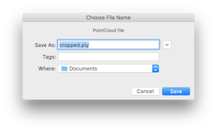
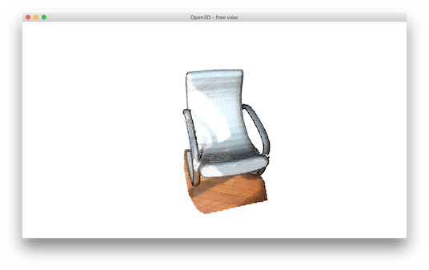
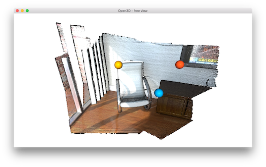
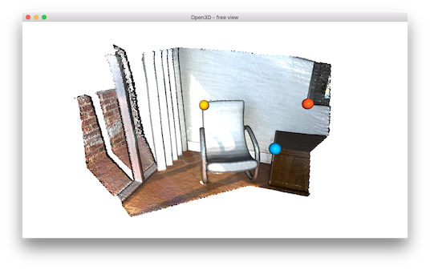
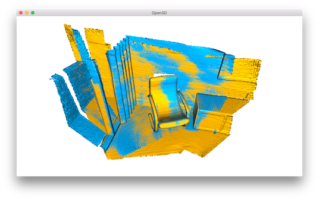

.. _interactive_visualization:

Interactive visualization
-------------------------------------

This tutorial introduces user interaction features of the visualizer window.

.. literalinclude:: ../../../examples/python/visualization/interactive_visualization.py
   :language: python
   :lineno-start: 5
   :lines: 5-
   :linenos:

This script executes two applications of user interaction: ``demo_crop_geometry`` and ``demo_manual_registration``.

.. _crop_geometry:

Crop geometry
``````````````````````````````````````

.. literalinclude:: ../../../examples/python/visualization/interactive_visualization.py
   :language: python
   :lineno-start: 12
   :lines: 12-23
   :linenos:

This function simply reads a point cloud and calls ``draw_geometries_with_editing``. This function provides vertex selection and cropping.

.. Note:: Open3D has a ``VisualizerWithEditing`` class that inherits ``Visualizer`` class. It adds graphic user interaction features. Likewise examples in :ref:`customized_visualization`, ``VisualizerWithEditing()`` can be explicitly used instead of ``draw_geometries_with_editing([pcd])``.

Once a geometry is displayed, press ``Y`` twice to align geometry with negative direction of y-axis. After adjusting viewing orientation, press ``K`` to lock screen and to switch to the selection mode.

.. image:: ../../_static/visualization/interactive_visualization/crop_lock.png
    :width: 400px

.. Tip:: The practical step for selecting area is to align the geometry with arbitrary axis using orthographic projection model. This trick makes selection easier, because it avoids self-occlusion hassle due to perspective projection.

To select a region, use either ``mouse drag`` (rectangle selection) or ``ctrl + left mouse click`` (polygon selection). The below example shows a selected area using a polygon.

.. image:: ../../_static/visualization/interactive_visualization/crop_selection.png
    :width: 400px

Note that the selected area is dark shaded. To keep the selected area and discard the rest, press ``C``. A dialog box appears, which can be used to save the cropped geometry. The cropping result is shown after saving.



.. image:: ../../_static/visualization/interactive_visualization/crop_result.png
    :width: 400px

To finish selection mode, press ``F`` to switch to freeview mode.



.. _manual_registration:

Manual registration
`````````````````````````````````````````````

Select correspondences
=====================================

The following script registers two point clouds using point-to-point ICP. It gets initial alignment via user interaction.

.. literalinclude:: ../../../examples/python/visualization/interactive_visualization.py
   :language: python
   :lineno-start: 51
   :lines: 51-60
   :linenos:

The script reads two point clouds, and visualizes the point clouds before alignment.

.. image:: ../../_static/visualization/interactive_visualization/manual_icp_initial.png
    :width: 400px

.. literalinclude:: ../../../examples/python/visualization/interactive_visualization.py
   :language: python
   :lineno-start: 35
   :lines: 35-48
   :linenos:

The function ``pick_points(pcd)`` makes an instance of ``VisualizerWithEditing``. To mimic ``draw_geometries``, it creates windows, adds the geometry, visualizes the geometry, and then terminates. A novel interface function from ``VisualizerWithEditing`` is ``get_picked_points()`` that returns the indices of user-picked vertices.

To pick a vertex, press ``shift + left click`` on a window. If a vertex is selected, the visualizer window overlays a sphere on a selected vertex. For example, after picking three vertices in the source point cloud, it shows:



This will print:

.. code-block:: sh

    Picked point #58481 (2.14, 1.56, 1.53) to add in queue.
    Picked point #77321 (2.86, 1.92, 1.09) to add in queue.
    Picked point #42639 (3.28, 1.53, 1.45) to add in queue.

Press ``Q`` to close the window. The next step is to pick the same correspondences in the target point cloud. The color of the sphere helps to identify the same correspondence.



This will print:

.. code-block:: sh

    Picked point #54028 (1.62, 1.81, 1.23) to add in queue.
    Picked point #97115 (2.45, 2.19, 1.11) to add in queue.
    Picked point #47467 (2.75, 1.71, 1.45) to add in queue.

.. Tip:: To get a good registration result, try to pick more than three points that are well-distributed in the scene. Using a vertex in the corner region is a good way to easily pick the right correspondence.

Registration using user correspondences
=======================================

.. literalinclude:: ../../../examples/python/visualization/interactive_visualization.py
   :language: python
   :lineno-start: 61
   :lines: 61-80
   :linenos:

The later part of the demo computes an initial transformation based on the user-provided correspondences. This script builds pairs of correspondences using ``Vector2iVector(corr)``. It utilizes ``TransformationEstimationPointToPoint.compute_transformation`` to compute the initial transformation from the correspondences. The initial transformation is refined using ``registration_icp``.

The registration result is as follows:


