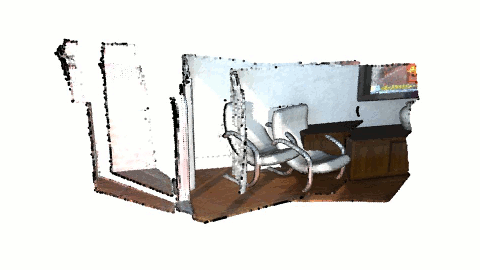

.. _non_blocking_visualization:

Non-blocking visualization
-------------------------------------

``draw_geometries()`` is a useful function to get a quick overview of static geometries. However, this function holds a process until a visualization window is closed. This is not optimal when geometry is updated and needs to be visualized without closing the window. This tutorial introduces an example to customize the rendering loop.

Review draw_geometries
````````````````````````````````````````````````````

``draw_geometries`` has the following rendering-loop (see ``Visualizer::Run()`` for the C++ implementation):

.. code-block:: bash

    while(true):
        if (geometry has changed):
            re-bind geometry to shaders
        if (view parameters have changed):
            re-render the scene
        if (any user mouse/keyboard input):
            respond to it and set flags for re-rendering

Note that both binding geometry and rendering are costly operations, thus they are executed in a lazy way. There are two flags that control them individually. The functions ``update_geometry`` and ``update_renderer`` set these flags. After rebinding/rendering, these flags are cleared once again.

This rendering loop can be readily customized. For example, a custom loop can be made in this way to visualize ICP registration:

.. code-block:: python

    vis = Visualizer()
    vis.create_window()
    for i in range(icp_iteration):
        # do ICP single iteration
        # transform geometry using ICP
        vis.update_geometry(geometry)
        vis.poll_events()
        vis.update_renderer()

The full script implementing this idea is displayed below.

.. literalinclude:: ../../../examples/python/visualization/non_blocking_visualization.py
   :language: python
   :lineno-start: 27
   :lines: 27-
   :linenos:

The following sections explain this script.

Prepare example data
````````````````````````````````````````````````````

.. literalinclude:: ../../../examples/python/visualization/non_blocking_visualization.py
   :language: python
   :lineno-start: 35
   :lines: 35-46
   :linenos:

This part reads two point clouds and downsamples them. The source point cloud is intentionally transformed for the misalignment. Both point clouds are flipped for better visualization.


Initialize Visualizer class
````````````````````````````````````````````````````

.. literalinclude:: ../../../examples/python/visualization/non_blocking_visualization.py
   :language: python
   :lineno-start: 47
   :lines: 47-59
   :linenos:

These lines make an instance of the visualizer class, open a visualizer window, and add two geometries to the visualizer.

Transform geometry and visualize it
````````````````````````````````````````````````````

.. literalinclude:: ../../../examples/python/visualization/non_blocking_visualization.py
   :language: python
   :lineno-start: 59
   :lines: 59-72
   :linenos:

This script calls ``registration_icp`` for every iteration. Note that it explicitly forces only one ICP iteration via ``ICPConvergenceCriteria(max_iteration = 1)``. This is a trick to retrieve a slight pose update from a single ICP iteration. After ICP, source geometry is transformed accordingly.

The next part of the script is the core of this tutorial. ``update_geometry`` informs the ``vis`` that the related geometries are updated. Finally, the visualizer renders a new frame by calling ``poll_events`` and ``update_renderer``. After any for-loop iterations, ``destroy_window`` closes the window.

The result looks like the image below.


