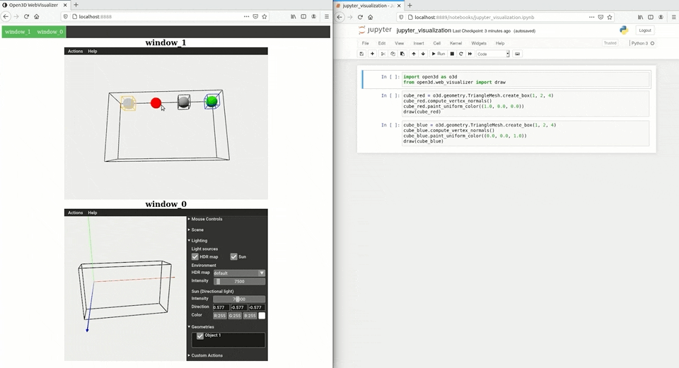

.. _web_visualizer:

Web visualizer and Jupyter
==========================

1. Introduction
---------------

Open3D web visualizer enables advanced rendering and visualization of 3D models
in modern browsers. You first start the visualization server on a local
or remote machine, and then the 3D models can be viewed from any device with
a modern browser. The web visualizer server and client communicate via the
`WebRTC <https://en.wikipedia.org/wiki/WebRTC>`_ (Web Real-Time Communication)
protocol.

In this tutorial, we cover two common use cases:

- Standalone mode: Run Open3D web visualizer server as a standalone application
  and view the 3D models in a browser. It supports both C++ and Python. You'll
  only need add one line to your code to enable the server.
- Jupyter mode: Run Open3D web visualizer as embedded Jupyter cells. It supports
  both the Python Jupyter notebook and Jupyter lab environments. You'll need
  to modify your code to use the non-blocking APIs and wrappers.

As of release ``0.13``, Open3D web visualizer is supported on the following
platforms:

..
  Table generation: https://www.tablesgenerator.com/text_tables

+----------------------------------------------+--------+-------+---------+
|                                              | Ubuntu | macOS | Windows |
+==============================================+========+=======+=========+
| Standalone mode server (C++/Python)          | Yes    | Yes   | Yes     |
+----------------------------------------------+--------+-------+---------+
| Jupyter mode server (Python)                 | Yes    | No    | Yes     |
+----------------------------------------------+--------+-------+---------+
| Standalone/Jupyter mode client (web browser) | Yes    | Yes   | Yes     |
+----------------------------------------------+--------+-------+---------+

Additional notes on compatibility:

- On Ubuntu, web visualizer server runs on EGL. This is supported in most
  machines as long as the it has graphics capabilities (either via integrated
  graphics or discrete GPU). A discrete GPU will be required if the CPU does not
  come with integrated graphics. For example, AWS cloud instances typically use
  Intel XEON processors without integrated graphics. You'll need to add a
  discrete GPU to the instance and install the graphics driver to enable the web
  visualizer.
- Web visualizer servers are not supported on the ARM6 platform.

2. Standalone mode
------------------

In standalone mode, Open3D web visualizer server runs as a standalone
application. It supports both C++ and Python. You'll only need to make very
minimal changes to your code to enable the server.

C++ server
::::::::::

Ensure ``-DBUILD_GUI=ON`` and ``-DBUILD_WEBRTC=ON`` are set in the CMake config
step (they are set to ``ON`` by default). In your C++ code, enable the WebRTC
server backend by calling:

.. code-block:: cpp

    open3d::visualization::webrtc_server::WebRTCWindowSystem::GetInstance()->EnableWebRTC();

Example:

.. code-block:: sh

    mkdir build && cd build
    cmake ..
    make DrawWebRTC -j$(nproc)
    cd bin/example
    ./DrawWebRTC
    google-chrome http://localhost:8888  # Or, open the address in your browser

Python server
:::::::::::::

In your Python code, enable the WebRTC server backend by calling:

.. code-block:: python

    import open3d as o3d
    o3d.visualization.webrtc_server.enable_webrtc()

Example:

.. code-block:: sh

    python examples/python/gui/draw_webrtc.py
    google-chrome http://localhost:8888  # Or, open the address in your browser

IP/port binding
:::::::::::::::

Similar to other web servers, the Open3D web visualizer server allows binding
to custom IP address and port. This is typically required for setting up remote
servers.

To set custom IP address, set the ``WEBRTC_IP`` environment variable. To set
custom port number, set the ``WEBRTC_PORT`` environment variable. For instance:

.. code-block:: sh

    # Bind to localhost:8888 (default)
    python examples/python/gui/draw_webrtc.py

    # Bind to 127.0.0.1:8889
    WEBRTC_IP=127.0.0.1 WEBRTC_PORT=8889 python draw_webrtc.py

To enable remote visualization, we typically bind to the internal IP and
internal port as seen by the server. The router may translate the internal IP
and internal port to external IP and port. For instance, on Google cloud, we
can get the `internal and external IP <https://cloud.google.com/compute/docs/ip-addresses>`_.
of the instance. We then set the ``WEBRTC_IP`` and ``WEBRTC_PORT`` to the
internal IP and port, enable the corresponding port in the firewall rules and
enable HTTP traffic. Finally, we start the web visualizer server and visit the
external IP address from the browser.

.. warning::

    Although the WebRTC traffic is encrypted, the web server uses HTTP by
    default which is not encrypted and is suitable only for local access. If
    used for remote visualization, the web page will be visible and controllable
    by any one with network access. For sensitive or confidential data, please
    rebuild with `appropriate web server configuration and SSL certificates
    <https://github.com/civetweb/civetweb/blob/master/docs/OpenSSL.md>`_.

3. Jupyter mode
---------------

Install Jupyter with:

.. code-block:: sh

    pip install jupyter
    jupyter notebook

or, you may also install JupyterLab instead:

.. code-block:: sh

    pip install jupyterlab
    jupyter-lab

Then, run the example in
``examples/python/visualization/jupyter_visualization.ipynb``.

.. warning::

    For remote visualization, please use a `secure Jupyter server
    <https://jupyter-notebook.readthedocs.io/en/stable/public_server.html>`_.

Non-blocking functions
::::::::::::::::::::::

In Jupyter mode, we need to avoid blocking visualization API calls.
Otherwise, running visualization in one cell will block the execution of the
next cell. We provide Jupyter-specific helper functions to achieve non-blocking
visualization. For instance, ``open3d.web_visualizer.draw`` is used instead of
the regular ``open3d.visualization.draw`` in the example notebook above.

Besides ``draw``, you may also create your own non-blocking visualization helper
functions with the ``_AsyncEventLoop`` class. See
``python/open3d/web_visualizer.py`` for the  ``_AsyncEventLoop`` class and
the implementation of ``open3d.web_visualizer.draw`` as and example.

Build Jupyter package from source
:::::::::::::::::::::::::::::::::

Open3D official Python wheels come with Jupyter web visualizer support.
To build Open3D Python package from source with Jupyter web visualizer, you'll
need to :

1. Install ``npm`` and ``yarn``. For example, you may
   `install npm via a package manager <https://nodejs.org/en/download/package-manager/>`_,
   and install ``yarn`` by ``npm install -g yarn``. Make sure they can be called
   from the terminal.
2. Install Jupyter build dependencies:

   .. code-block:: sh

     pip install -r python/requirements_jupyter.txt

3. Build Open3D Python package:

   .. code-block:: sh

     mkdir build && cd build
     cmake -DBUILD_JUPYTER_EXTENSION ..
     make install-pip-package -j$(nproc)

4. Advanced topic: local server in airplane mode
------------------------------------------------

When the computer has no active network interfaces (e.g. Wi-Fi is turned off and
ethernet is unplugged, the machine only has the loopback ``lo`` interface),
WebRTC may fail to work. In this case, we need to create a dummy interface.
The workaround is tested on Ubuntu.

.. code-block:: sh

    # Setup
    sudo ip link add dummy0 type dummy
    sudo ip addr add 1.1.1.1/24 dev dummy0
    sudo ip link set dummy0 up

    # Check interfaces
    ip addr

    # Do WebRTC things here
    python examples/python/gui/draw_webrtc.py
    google-chrome http://localhost:8888  # Or, open the address in your browser

    # Clean up
    sudo ip link set dummy0 down
    sudo ip link delete dummy0

5. Advanced topic: TURN server
------------------------------

WebRTC's `ICE <https://developer.mozilla.org/en-US/docs/Glossary/ICE>`_
(Interactive Connectivity Establishment) framework resolves client-server
connection via `STUN <https://developer.mozilla.org/en-US/docs/Glossary/STUN>`_
or `TURN <https://developer.mozilla.org/en-US/docs/Glossary/TURN>`_ servers.

In most scenarios, a STUN server is sufficient to figure out the traffic
routing. In certain network configurations (e.g. behind a NAT or firewall),
a TURN server is required to forward WebRTC traffic. You may add your custom
TURN server (video traffic relay) by setting the ``WEBRTC_STUN_SERVER``
environment variable. If you have more than one TURN servers, separate them
with ``;``. For instance:

.. code-block:: sh

    # UDP only
    WEBRTC_STUN_SERVER="turn:user:password@my_turn_server.com:3478"
    # TCP only
    WEBRTC_STUN_SERVER="turn:user:password@my_tcp_turn_server.com:3478?transport=tcp"
    # UDP and TCP (more than one TURN servers)
    WEBRTC_STUN_SERVER="turn:user:password@my_turn_server.com:3478;turn:user:password@my_tcp_turn_server.com:3478?transport=tcp"

6. Advanced topic: debugging network issues
-------------------------------------------

You may face issues such as failure to connect, lag or low visualization quality
in specific network configurations (e.g. NAT, network proxy, VPN configurations).
Here are some ideas to debug network issues:

- Make sure localhost works before trying to host a remote server. Make sure
  standalone mode works before trying the Jupyter mode.
- Test both client and server machines for connectivity and throughput at
  `https://test.webrtc.org/ <https://test.webrtc.org/>`_.
- If you face control lag, try switching from TCP to UDP connection or switching
  to a closer TURN server.
- If the visualization video has compression artifacts, you may be using a TURN
  server (video traffic relay) with insufficient bandwidth. Try disabling TURN
  servers or switching to a server with higher bandwidth or closer to your
  location.
